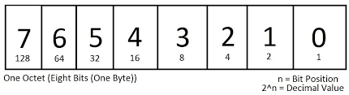

# What is Internet Protocol Address (IP Address)

#### IP Address:

- Just like in real life, if we want to communicate with someone, we need a phone 📞—either a landline or a mobile device 📱. In addition, we need a phone number, and that number must be unique 🔢. Only then can communication happen smoothly.

- In the same way, when two or more systems need to communicate with each other 💻↔️💻, each system must have a unique identifier. These identifiers are called IP addresses 🌐.

- IP addresses are 32 bits in IPv4 and 128 bits in IPv6. For now, we will focus on the 32-bit IPv4 addressing scheme 📘.

### 1. bit and bytes

#### Computer Understands binary digits, and bits are represented into 0 and 1

#### - minimum value is 0

#### - maximum value is 1

#### 32 bits are divided into 4 parts called 4 bytes.

#### 1 byte = 8 bits or called as Octect.

### Calculating the Range

- Minimum Value (0): This occurs when all 8 bits are set to 0 (\(00000000\_{2}\)).

- Maximum Value (255): This occurs when all 8 bits are set to 1 (\(11111111\_{2}\)). To find the total value, you must sum the weights of every bit position:\(128+64+32+16+8+4+2+1=255\)

### Mathematical Formula

- A simpler way to calculate the maximum value for any number of bits (\(n\)) is using the formula \(2^{n}-1\). Since an octet has 8 bits:
  - 2 ^ 8 - 1
  - 256 - 1
  - 255
