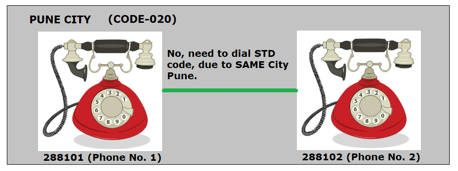
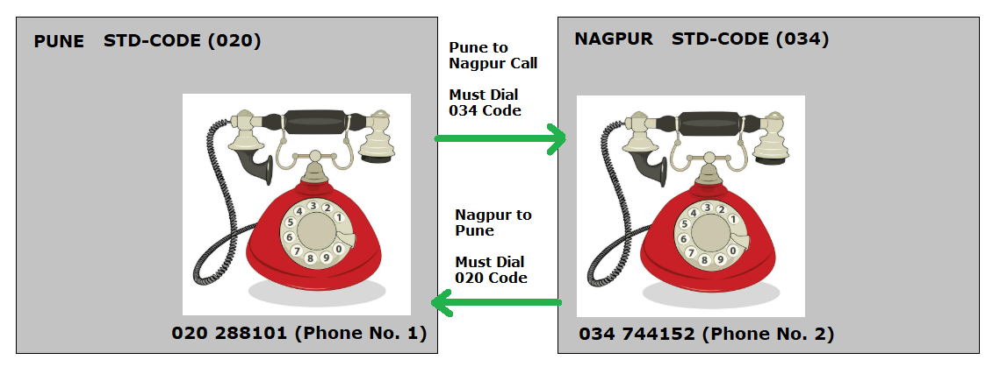

# 🌐 How to Recognize Networks

### 📘 Let’s understand networking using a real-world example

#### ☎️ Telephone Example (Real Life)

##### Let’s again take the example of telephone numbers, because it is easy to relate.

#### 📞 Consider the following phone numbers:

- 020 288101 (Phone No. 1)
- 020 288102 (Phone No. 2)

#### 🔍 What do we observe here?

- 020 is the STD (area) code
- Both phone numbers share the same STD code
- This means both phones belong to the same geographical area

#### ✅ Since they are in the same local network, there is no need to dial the STD code to communicate.

##### 📍 This is called local communication.

---

### ❓ What happens if phone numbers have different STD codes?

#### Now consider this example:

- 020 288101 (Phone No. 1)
- 034 744152 (Phone No. 2)

#### 🚦 What’s different?

- The STD codes are different (020 and 034)
- The phones belong to different geographical areas
- 📡 To communicate now, we must dial the STD code.
- 🌍 This is long-distance communication.

#### 💻 Networking World Comparison

- Just like phone networks, computer networks are also divided into types:

- 🏠 LAN – Local Area Network
- 🌎 WAN – Wide Area Network

---

### 🧩 Network Part vs Host Part

#### In networking, every IP address is divided into two parts:

#### 1. Network Part 🧱 → Identifies the network

#### 2. Host Part 🖥️ → Identifies the device within that network

#### 👉 Based on these parts, we decide whether two machines are:

- In the same network (LAN)
- Or in different networks (WAN)

---

### 🎭 What Separates Networks?

#### Networks are separated using a method called Masking 🥷

- 📞 In phone systems → we use STD codes
- 💻 In computer networks → we use Subnet Masks

#### 🧮 Common Subnet Masks

#### Some commonly used subnet masks are:

- 255.255.255.0
- 255.255.0.0
- 255.0.0.0

#### 🔹 There are other possibilities too, but we’ll keep it simple for now.

---

### 🧪 Subnetting Example (Very Important!)

#### Let’s take two machines:

#### Machine 1 IP → 172.24.1.10

#### Machine 2 IP → 172.24.2.20

#### 🔹 Case 1: Subnet Mask → 255.255.255.0

#### 📌 Here:

- First 3 octets → Network part
- Last 1 octet → Host part

#### Result:

- 172.24.1.10 → Network: 172.24.1 | Host: 10
- 172.24.2.20 → Network: 172.24.2 | Host: 20

#### 🚫 Network parts are different

#### ❌ Machines are NOT in the same network

---

#### 🔹 Case 2: Subnet Mask → 255.255.0.0

#### 📌 Here:

- First 2 octets → Network part
- Remaining octets → Host part

#### Result:

- 172.24.1.10 → Network: 172.24 | Host: 1.10
- 172.24.2.20 → Network: 172.24 | Host: 2.20

#### ✅ Network parts are same

#### 🎉 Machines are IN the same network

---

### 🚀 Final Takeaway

#### 🔥 Subnet Masking is the real game changer

#### It decides:

#### Whether machines are in the same network Or need routing to communicate.

- 📞 STD Code in phones
- 💻 Subnet Mask in networking

#### Once you understand this comparison, networking becomes much easier 💡

---
