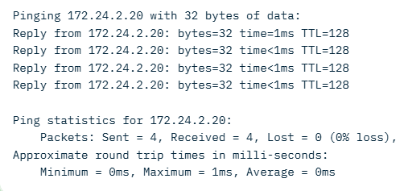

# 🌐 How to Configure Basic Networking (Windows)

Configuring a network allows multiple computers to **communicate and share resources** such as files, printers, and internet access. This guide explains the fundamentals and provides a **step-by-step walkthrough** using two Windows machines.

---

## ✅ Core Requirements to Connect a Machine to a Network

To place any computer on a network, the following **four elements** must be properly configured:

- 🧮 **IP Address** – A unique identifier for the machine on the network
- 🎭 **Subnet Mask** – Defines the network boundary
- 💻 **Computer (Host) Name** – Identifies the machine
- 🧑‍🤝‍🧑 **Workgroup Name** – Logical grouping of computers on the same network

---

## 🏘️ Understanding a Workgroup

A **workgroup** is a simple peer-to-peer network model commonly used in homes or small offices.

**Key Characteristics:**

- 🤝 All computers are **peers** (no central authority)
- 👤 Each computer maintains its **own user accounts**
- 🔢 Typically supports **up to ~20 computers**
- 🔓 No centralized password protection
- 🌐 All computers must be on the **same local network/subnet**

---

## 🧩 Network Scenario Overview

We will configure **two Windows machines** (Machine A and Machine B) to communicate within the same network using **static IP addressing**.

### 🖥️ Network Details

| Machine | IP Address  | Subnet Mask | Workgroup   |
| ------- | ----------- | ----------- | ----------- |
| A       | 172.24.1.10 | 255.255.0.0 | HOMENETWORK |
| B       | 172.24.2.20 | 255.255.0.0 | HOMENETWORK |

These IPs belong to the **private IPv4 range (172.16.0.0 – 172.31.255.255)** and fall within the same **/16 subnet**, allowing direct communication.

---

## 🧭 Network Diagram (Logical View)

```
        ┌──────────────┐        ┌──────────────┐
        │  Machine A   │        │  Machine B   │
        │ 172.24.1.10  │◀──────▶│ 172.24.2.20  │
        │ /16 Subnet   │        │ /16 Subnet   │
        └──────────────┘        └──────────────┘
                 Same Network: 172.24.0.0/16
```

---

## 🛠️ Step 1: Configure IP Address and Subnet Mask

Static IP addressing ensures predictable communication between machines.

### 🔹 Machine A Configuration

1. ⚙️ Open **Settings** → **Network & Internet**
2. 🔌 Select **Ethernet** (or Wi‑Fi if applicable)
3. 📄 Click **Properties** → **Edit IP Assignment**
4. 🔄 Change from **Automatic (DHCP)** to **Manual**
5. ✅ Enable **IPv4** (disable IPv6 for simplicity)
6. ✏️ Enter:

   - IP Address: `172.24.1.10`
   - Subnet Mask: `255.255.0.0` (Prefix: 16)
   - Gateway: _(Leave blank)_
   - DNS: _(Optional – e.g., 8.8.8.8)_

7. 💾 Click **Save**

🔍 **Verification:**

- Open Command Prompt and run:

  ```
  ipconfig
  ```

- Confirm the IPv4 address and subnet mask.

---

### 🔹 Machine B Configuration

Repeat the same steps using:

- IP Address: `172.24.2.20`
- Subnet Mask: `255.255.0.0`

✅ At this point, both machines are on the same logical network.

---

## 🧑‍🤝‍🧑 Step 2: Configure the Workgroup Name

Workgroups enable **network discovery and resource sharing**.

### 🔹 Steps (Perform on Both Machines)

1. 🖱️ Right‑click **Start** → **System**
2. ℹ️ Open **About** → **Advanced system settings**
3. 🏷️ Go to **Computer Name** tab → **Change**
4. 🧑‍🤝‍🧑 Select **Workgroup** and enter:

   ```
   HOMENETWORK
   ```

5. 🔁 Restart the system when prompted

📂 After reboot, machines should appear in **File Explorer → Network**.

---

## 📡 Step 3: Test Connectivity Using Ping

The `ping` command verifies whether machines can reach each other.

### 🔹 From Machine A → Machine B

```
ping 172.24.2.20
```

### 🔹 From Machine B → Machine A

```
ping 172.24.1.10
```

📸 **Expected Result:**



- Replies such as `Reply from 172.24.x.x` indicate success
- Low latency (<1 ms) confirms proper configuration

❌ If ping fails:

- 🔥 Check Windows Firewall
- 🔌 Verify cables or switch
- 🔁 Reconfirm IP settings

---

## 🎯 Final Outcome

✔ Both machines can now communicate
✔ Resource sharing (files/printers) is enabled
✔ Ideal setup for **home labs, classrooms, and small offices**

> 🔑 **Key Purpose of Networking:** Resource sharing and communication — nothing more, nothing less.

---

✨ You now have a clean, structured, and beginner‑friendly networking setup guide.

---
