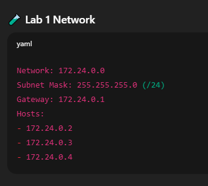
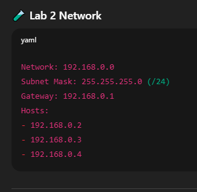
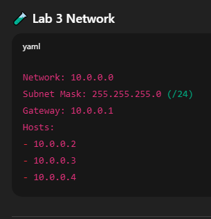
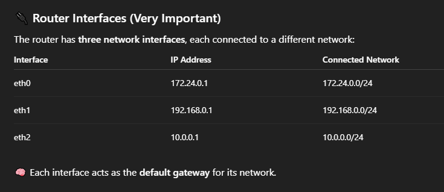
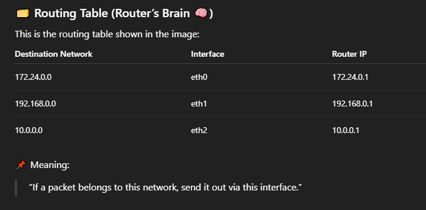
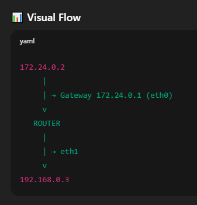
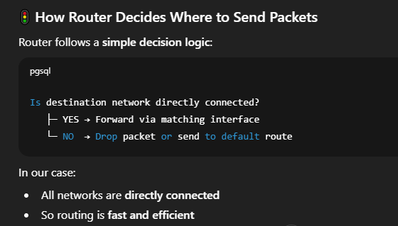
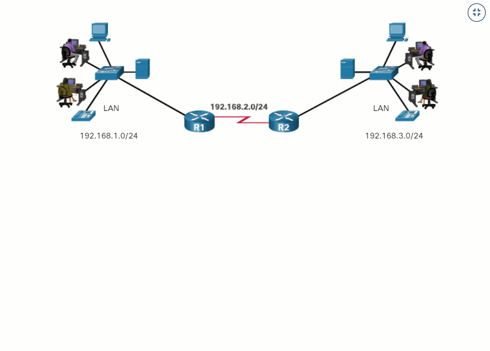

# 🌐 Gateway / Router – Practical Example Explained

#### This document explains how a Router (Gateway) connects multiple networks using a real example taken from the attached diagram.

#### We will use:

- 3 different networks
- 1 router
- A routing table
- Real IP addresses

---

#### 🧠 What Is a Router / Gateway?

#### A Router (also called Gateway) is a device that:

- Connects different networks
- Decides where data should go
- Uses a routing table to forward packets
- 🧭 Think of a router as a traffic controller between networks.

#### 🗺️ Network Topology Used in This Example

##### We have three separate networks:

---

---

---

---

---

### 🔁 How the Router Works (Step-by-Step Flow)

#### 🎯 Example 1: Host in Lab1 talks to Lab2

- Source: 172.24.0.2
- Destination: 192.168.0.3

#### 🛠 Flow:

- 172.24.0.2 sees destination is not in its own network
- Sends packet to its gateway: 172.24.0.1
- Router receives packet on eth0
- Router checks routing table 🔍
- Finds 192.168.0.0 → eth1
- Packet forwarded via eth1
- Destination host 192.168.0.3 receives packet ✅

---

---

#### 🎯 Example 2: Lab2 talks to Lab3

- Source: 192.168.0.4
- Destination: 10.0.0.2

#### 🛠 Flow:

- Packet sent to gateway 192.168.0.1
- Router receives on eth1
- Routing table lookup 🔍
- Match found: 10.0.0.0 → eth2
- Packet sent out via eth2
- Host 10.0.0.2 receives packet

---

---

### 🌟 Key Benefits of This Router Setup

- ✅ Interconnects three isolated networks
- ✅ Each lab communicates securely
- ✅ Clear traffic separation
- ✅ Scalable design
- ✅ Real-world enterprise topology

---

### 🧠 Why This Is Called a Gateway

#### Each network uses the router IP as: Default Gateway

#### Example:

- Lab1 → 172.24.0.1
- Lab2 → 192.168.0.1
- Lab3 → 10.0.0.1

#### 🚪 This IP is the exit door of the network.

---

### 📌 Important Observations

- Router operates at Layer 3 (Network Layer)
- Routing is based on IP addresses
- MAC addresses change per hop
- IP addresses remain end-to-end

---

### Router Functioning Overall View

---

### 🎯 Final Summary

- 🧭 Router connects multiple networks
- 🗂️ Uses routing table to forward packets
- 🔌 Each interface belongs to one network
- 🚪 Gateway is simply the router’s interface IP
- 🌍 Enables communication between isolated labs

---
