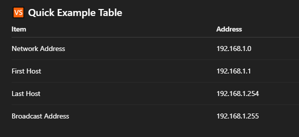

# How to calculate 🧮 Network Address, Broadcast Address & Valid Hosts ?

### 🧠 Why Do We Need These?

#### In networking, every IP network has:

- 🏠 Network Address (start of the network)
- 📢 Broadcast Address (end of the network)
- 👥 Valid Host IPs (usable IPs for devices)

#### Note: These help computers communicate correctly without confusion.

---

### 📌 Basic Terms (Very Simple)

#### 🌐 IP Address

- An IP address identifies a device on a network.
- Example: 192.168.1.10

#### 🎭 Subnet Mask

##### The subnet mask tells:

- Which part is network
- Which part is host
- Example: 255.255.255.0 or /24

---

### 🏠 What is a Network Address?

- The first address in a network.
- Identifies the whole network.
- Cannot be assigned to any device.
- Example: 192.168.1.0

---

### 📢 What is a Broadcast Address?

- The last address in a network.
- Used to send data to all devices.
- Cannot be assigned to any device.
- Example: 192.168.1.255

### 👥 What are Valid Host Addresses?

- IP addresses that can be assigned to devices.
- Start after Network Address.
- End before Broadcast Address.
- Example: 192.168.1.1 – 192.168.1.254

---

### 🧑‍💻 Step-by-Step Calculation (Easy Method)

#### 🧩 Given:

- IP Address: 192.168.1.10
- Subnet Mask: 255.255.255.0 (/24)

### ✅ Step 1: Identify the Network Size

##### /24 means:

- First 3 octets = network
- Last octet = host

---

### ✅ Step 2: Find Network Address

##### Set all host bits to 0:

- Network Address = 192.168.1.0

---

### ✅ Step 3: Find Broadcast Address

##### Set all host bits to 1:

- Broadcast Address = 192.168.1.255

---

### ✅ Step 4: Find Valid Host Range

##### First usable IP = Network + 1

##### Last usable IP = Broadcast − 1

##### Valid Hosts = 192.168.1.1 to 192.168.1.254

---

#### 🔢 Formula for Number of Hosts

Number of Hosts = 2^(Host bits) − 2

---

#### Example:

##### /24 → Host bits = 8

##### 2^8 − 2 = 254 hosts

---

### ⚠️ Important Rules to Remember

- Network address ❌ not usable
- Broadcast address ❌ not usable
- Only middle IPs are valid hosts ✅

##### Every subnet always has:

- 1 Network address
- 1 Broadcast address

---

### 📘 Quick Summary

- Network Address = First IP 🏠
- Broadcast Address = Last IP 📢
- Valid Hosts = Between them 👥
- Use subnet mask to calculate
- /24 subnet gives 254 usable hosts

#### 🎉 Now you can easily calculate Network, Broadcast, and Valid Host addresses!

---
