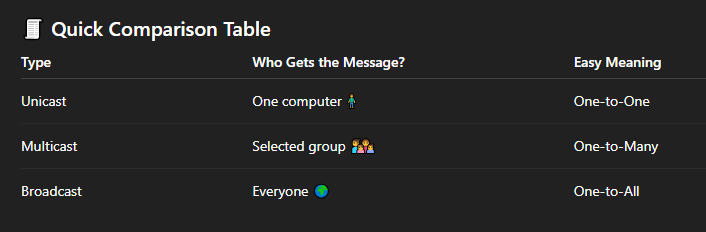
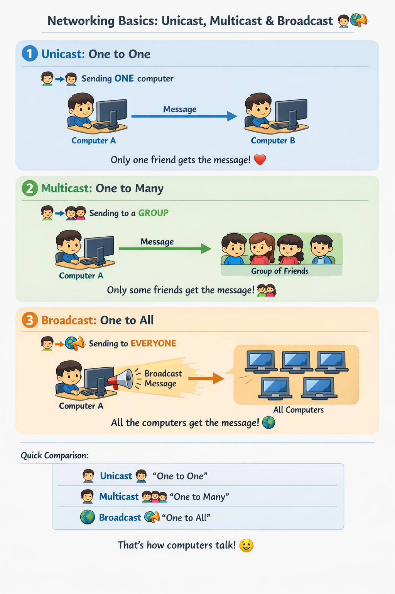

# 🌐 Networking Basics: Unicast, Multicast & Broadcast

#### Let’s learn how computers talk to each other on a network using three simple methods.

#### Think of computers like kids sending messages to each other. 💌

---

### 🧠 What Is Networking?

- Networking means computers sharing information with each other.
- They send messages called data 📦 through wires or Wi-Fi 📡.

Just like people talk in different ways:

- Talking to one person
- Talking to a group
- Shouting to everyone

Computers do the same! 😄

---

### 1️⃣ Unicast – Talking to One Friend 👦➡️👦

📌 What is Unicast?

Unicast means one sender talks to one receiver.

#### 🧸 Kid Example

- You whisper a secret 🤫 to one friend only.
- No one else hears it.

#### 💻 Computer Example

One computer sends data to one specific computer.

#### 🛠 How It Works (Step by Step)

- Computer A finds Computer B’s address 🏠
- Computer A sends the message 📩
- Only Computer B receives it ✅

#### 🧠 Simple Rule : 👉 One → One

### 📦 Real-Life Uses

- Visiting a website 🌍
- Sending an email 📧
- Watching a YouTube video 🎥

---

### 2️⃣ Multicast – Talking to a Group of Friends 👦➡️👦👦👦

#### 📌 What is Multicast?

- Multicast means one sender talks to many selected receivers.

#### 🧸 Kid Example

- A teacher 👩‍🏫 talks to only the kids in her class, not the whole school.

#### 💻 Computer Example

- One computer sends data to many computers that asked for it.

#### 🛠 How It Works (Step by Step)

- Computers say “I want to listen!” 🙋‍♂️🙋‍♀️
- Sender sends one message 📩
- Only the joined computers receive it 🎯

#### 🧠 Simple Rule

- 👉 One → Many (but not everyone)

#### 📦 Real-Life Uses

- Live video streaming 📺
- Online classes 🎓
- Stock market updates 📈

---

### 3️⃣ Broadcast – Shouting to Everyone 📣🌍

#### 📌 What is Broadcast?

- Broadcast means one sender talks to everyone on the network.

#### 🧸 Kid Example

You shout in the playground 🛝
“ICE CREAM TIME!” 🍦
All kids hear it!

#### 💻 Computer Example: One computer sends data to all computers on the network.

#### 🛠 How It Works (Step by Step)

- Computer sends a loud message 📣
- Every computer hears it 👂
- Computers decide if they care or not 🤷

### 🧠 Simple Rule: 👉 One → Everyone

#### 📦 Real-Life Uses

- Finding devices on a network 🔍
- Network announcements 📢
- ARP requests (asking “Who are you?”) ❓

---

---

### 🎯 Final Summary

- 🧍 Unicast: Talking to one friend
- 👨‍👩‍👧‍👦 Multicast: Talking to a group
- 🌍 Broadcast: Talking to everyone

Now you know how computers talk just like people do! 🥳

---

