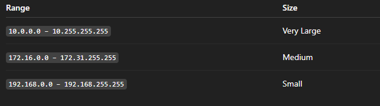
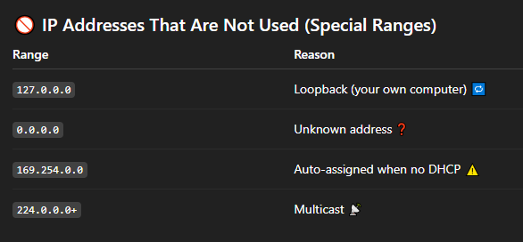
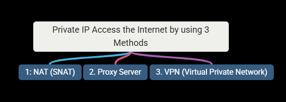
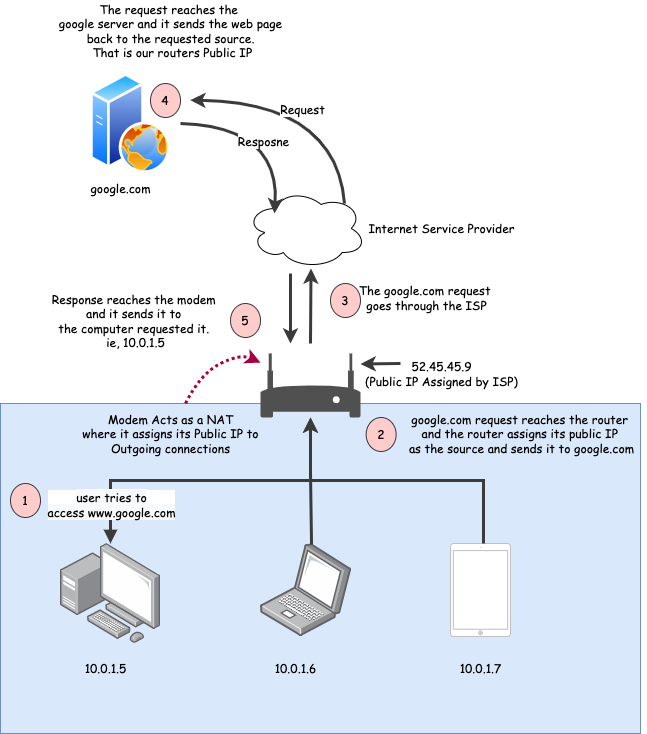
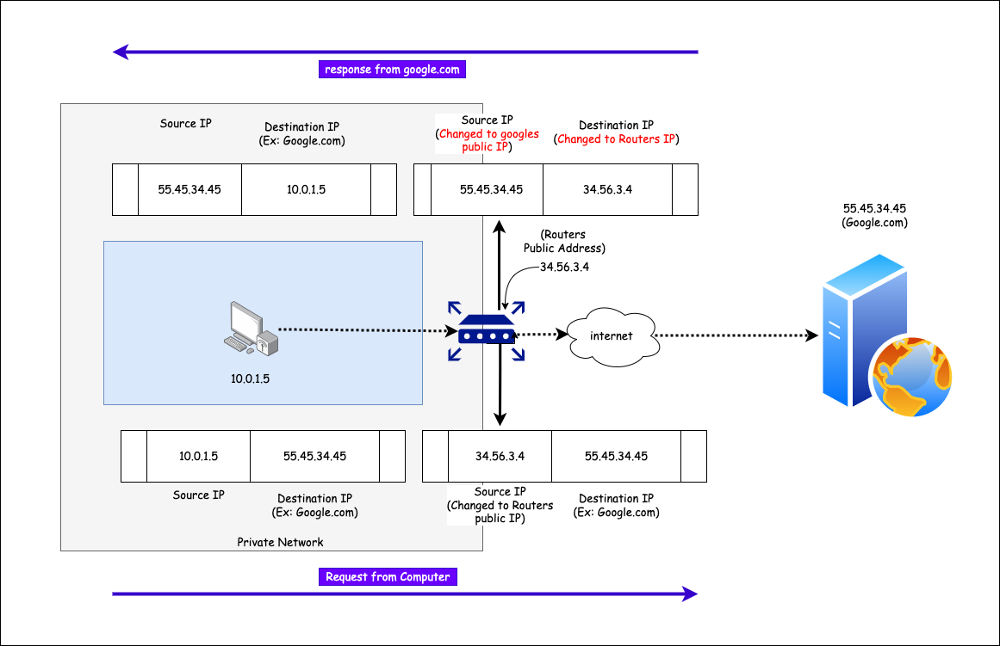
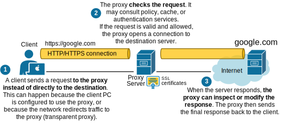
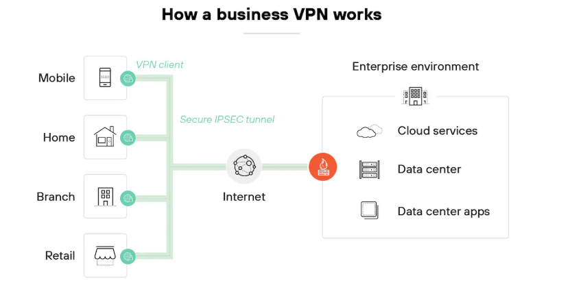
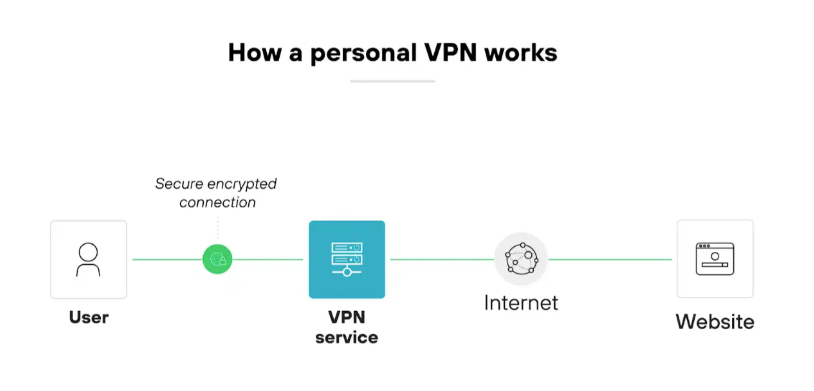
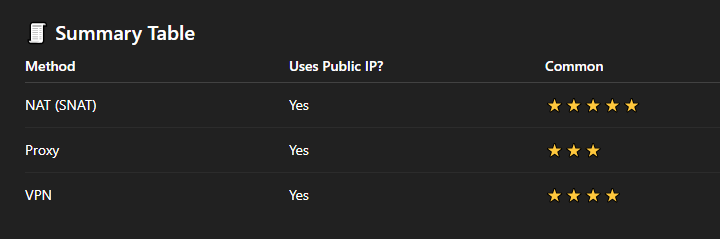

# 🌍 Public IP vs Private IP – Explained Simply

### Networking can sound scary 😵, but don’t worry.

- Let’s imagine the Internet as a big city 🏙️ and IP addresses as house numbers 🏠.

### 🧠 What Is an IP Address?

- An IP Address is a number that identifies a device on a network.
- Just like your home address tells where you live 🏡, an IP address tells where a computer lives on the Internet 🌐.

---

### 1️⃣ Public IP Address vs Private IP Address

#### ✅ What is it?

- A Public IP address is a unique address on the Internet.

#### 🧸 Kid Example

- Your home address 🏠 that the postman uses to deliver letters 📬.

### 💻 Technical Meaning

- Assigned by ISP (Internet Service Provider)
- Globally unique
- Can be reached from anywhere on the Internet

#### 📦 Example : 8.8.8.8

---

### 🏠 Private IP Address

#### ✅ What is it?

- A Private IP address is used inside a local network (home, office, school).

#### 🧸 Kid Example

- Your room number inside your house 🛏️
- The postman can’t see it from outside.

#### 💻 Technical Meaning

- Used inside LAN
- Not unique globally
- Cannot be accessed directly from the Internet

#### 📦 Example: 192.168.1.5

---

---

### 2️⃣ Why Are Public IP Addresses Paid? 💰

#### 🧠 Simple Reason

#### 👉 Public IP addresses are limited

#### 📦 Explanation

- IPv4 has only ~4.3 billion addresses
- Internet users are more than that 😬
- ISPs must buy, manage, and maintain them

#### 🧸 Kid Example

- There are only a few VIP seats 🎟️
- If you want one, you must pay.

#### 🧠 Result

- ISPs charge money
- Static Public IPs cost more 💵

---

### 3️⃣ Why Private IP Ranges Are Only 10, 172, and 192?

#### 📜 Reserved Private IP Ranges: These ranges are reserved by IANA (Internet Authority):

---

### ❓ Why Not 128.x.x.x or 130.x.x.x?

#### Because those ranges are:

- Already allocated for public use
- Used by companies, ISPs, governments
- 👉 Using them privately would cause Internet conflicts 💥

  

---

### 4️⃣ Why Private IPs Cannot Access the Internet Directly?

#### 🧠 Simple Answer

#### 👉 The Internet does not know private IPs

#### 🧸 Kid Example:

- You shout your room number outside 🗣️
- Nobody knows where that is.

#### 💻 Technical Reason

- Internet routers drop private IP packets
- They are not routable globally
- Designed for internal use only

---

### 5️⃣ How Can Private IPs Access the Internet? 🌐

#### Private IPs need help to talk to the Internet.

### 🥇 Method 1: NAT (SNAT) – Most Common

#### 🧠 What is NAT?

#### Network Address Translation

#### 🛠 How It Works

- Private IP sends request 🏠➡️
- Router replaces it with Public IP 🌍
- Internet replies to Public IP
- Router sends it back to Private IP

#### ✅ Used in

- Home routers 🏡
- Office networks 🏢

---

### 🥈 Method 2: Proxy Server 🧍‍♂️

#### 🧠 What is a Proxy?

#### A middleman server

#### 🛠 How It Works

- You send request to proxy
- Proxy sends request to Internet
- Proxy returns response

#### 📦 Example

- Corporate networks
- Content filtering

---

### 🥉 Method 3: VPN 🌐🔒

#### 🧠 What is VPN?

#### A secure tunnel to another network

#### 🛠 How It Works

- Private IP connects to VPN server
- VPN server has Public IP
- Internet traffic goes through VPN

---

---

### 🎯 Final Summary

#### 🌍 Public IP = Internet-visible address

#### 🏠 Private IP = Internal network address

#### 💰 Public IPs cost money because they are limited

#### 🚫 Private IPs are blocked on the Internet

#### 🔁 NAT, Proxy, and VPN help private IPs go online
