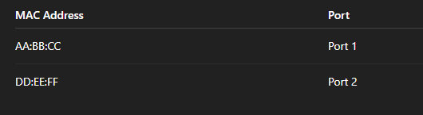
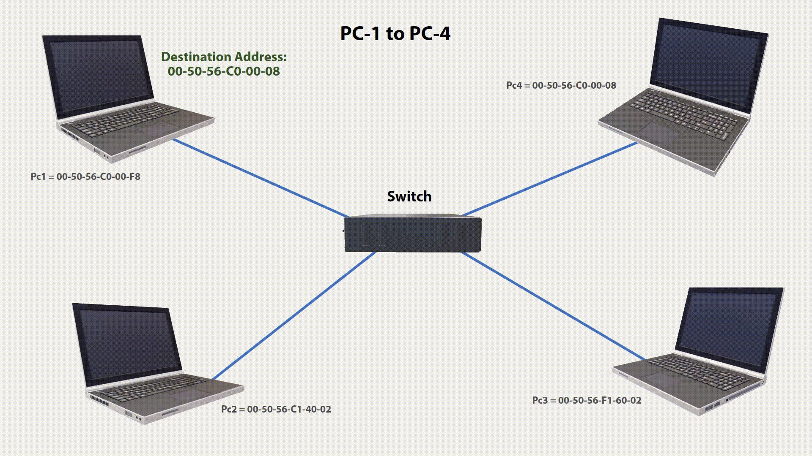
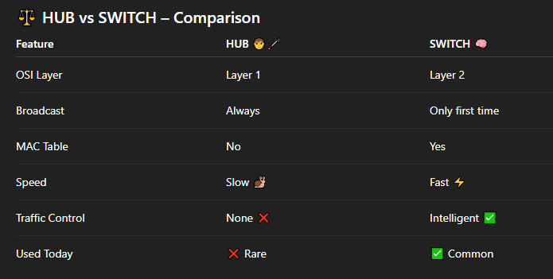

# 🔌 HUB vs SWITCH – Networking Made Super Simple

#### Imagine a room full of kids 🧒🧒🧒 and they want to send messages to each other.

#### Now imagine two different helpers who deliver messages differently:

#### 🧑‍🦯 HUB → not smart, shouts everything

#### 🧠 SWITCH → very smart, delivers quietly to the right person

#### Let’s learn how they work 👇

---

### 🧠 What Is a Hub?

#### 📌 Definition

- A Hub is a simple networking device that connects multiple computers and sends data to all devices every time.

#### 💡 Hub works at OSI Layer 1 (Physical Layer)

#### It does NOT understand:

- IP address ❌
- MAC address ❌

---

### 1️⃣ How a HUB Works 🔊

#### 🧸 Kid Example

#### One kid shouts 🗣️ a message in the classroom

#### ➡️ Every kid hears it, even if it’s not for them.

### 💻 Technical Working (Step-by-Step)

- Computer A sends data 📩 to Hub
- Hub copies the data
- Hub sends it to ALL connected computers 📢
- Only the correct computer accepts it
- Others discard it ❌

  

### 📊 Hub Message Flow (Broadcast Every Time)

#### ➡️ Message goes to PC1, PC2, PC3

#### ➡️ Even if it is meant only for PC2

---

### 2️⃣ Why HUB Causes Unnecessary Traffic 🚦

#### ❌ Problem with Hub:

- Always broadcasts
- Creates network noise
- Wastes bandwidth 📉
- Causes collisions 💥
- Slower network 🐌
- 🔴 Only one PC needs the data
- 🔴 But all PCs receive it

---

# 🧠 What Is a Switch?

#### 📌 Definition

- A Switch is an intelligent networking device that sends data only to the correct device.

- 💡 Switch works at OSI Layer 2 (Data Link Layer)

It understands:

- ✅ MAC addresses
- ❌ IP addresses (normally)

---

### 3️⃣ How a SWITCH Works 🧠✨

#### 🧸 Kid Example

#### A smart teacher 👩‍🏫 knows where every kid sits

#### ➡️ Gives notes only to the right kid

---

#### 📘 Important Concept: MAC Address

#### Each device has a MAC address (like a name tag 🏷️): AA:BB:CC:11:22:33

#### 🗂️ MAC Address Table (Switch Brain 🧠)

#### The switch maintains a MAC Table like this:

### 🔁 First Time Communication (Broadcast Happens ONCE)

#### 🛠 Step-by-Step

- PC1 sends data to Switch
- Switch does not know destination MAC ❓
- Switch broadcasts to all ports 📢
- Destination PC responds ✅
- Switch learns the MAC + Port
- Entry stored in MAC Table 🧠

### 🚀 Second Time Communication (NO Broadcast)

#### 🛠 Step-by-Step

- PC1 sends data again
- Switch checks MAC Table 🔍
- Finds correct port ✅
- Sends data only to target PC 🎯

#### 📊 Intelligent Forwarding Flow :

#### PC1 → SWITCH → PC2 ✅

#### ❌ PC3 & PC4 are NOT disturbed

#### ✅ Faster, cleaner network

#### 🤖 Why Switch Is Called Intelligent?

#### Because it can:

- 🧠 Learn MAC addresses
- 🗂️ Store MAC tables
- 🎯 Forward data selectively
- 🚦 Reduce traffic
- ⚡ Improve performance

---

---

### 🎯 Final Summary

- 📢 Hub = Shouts to everyone every time
- 🧠 Switch = Learns and sends only where needed
- 🚦 Hub increases traffic
- ⚡ Switch reduces traffic and improves speed
- 🌐 Modern networks use Switches, not Hubs

---
