# 🌐 IP Addressing & Subnetting – Complete Beginner Guide

### Networking looks complex at first 😵, but once you understand IP addressing and subnetting, everything becomes clear.

#### This document explains:

- What IP addresses are
- How IPv4 & IPv6 work
- Number systems used in networking
- How subnetting works step by step
- Easy ways to calculate networks and hosts

---

### 🧠 1. What Is an IP Address?

#### An IP Address (Internet Protocol Address) is a unique number assigned to a device on a network.

#### 📌 Purpose:

- Identify a device
- Locate a device
- Enable communication between devices

#### 🧸 Kid Example

#### Just like your home address 🏠 helps people find your house, an IP address helps computers find each other.

---

### 📜 2. History of IP Addresses

#### 🕰️ Early Days

- Internet started as ARPANET
- IPv4 was introduced in 1981
- IPv4 uses 32 bits

#### 🚨 Problem

- Too many devices 📱💻🌍
- IPv4 addresses started running out

#### 🆕 Solution

#### IPv6 introduced in 1998

#### Uses 128 bits

#### Almost unlimited addresses ♾️

---

### 🔢 3. Number Systems Used in Networking

- Computers don’t understand decimal numbers like humans 😄
- They use binary, and we represent them using other systems.

  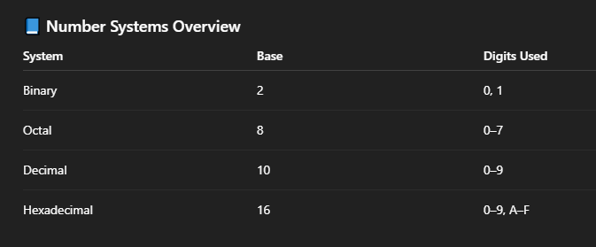

---

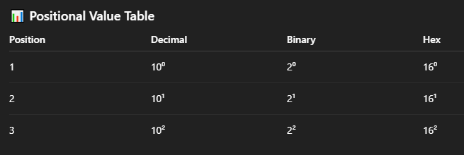

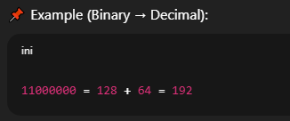

---

### 🌍 4. IPv4 Structure

#### 📌 IPv4 Basics

- 32-bit address
- Written in decimal dotted format
- 4 octets (8 bits each)
- #### Example : 192.168.1.10
- #### Binary : 11000000.10101000.00000001.00001010

---

### 🌐 5. IPv6 Structure

#### 📌 IPv6 Basics

- 128-bit address
- Written in hexadecimal
- Separated by colons
- #### Example: 2001:0db8:85a3:0000:0000:8a2e:0370:7334

---

### IPv4 v/s IPv6 Difference

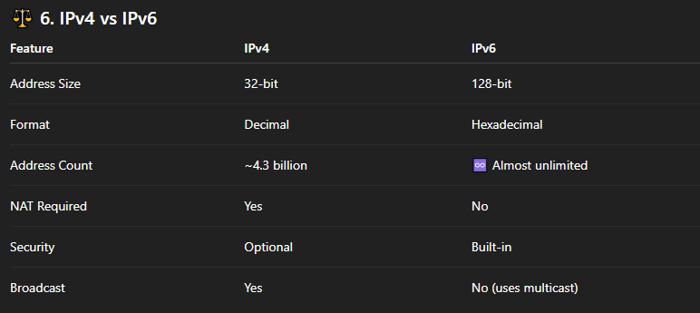

---

### 🧩 7. Network & Host Portion

#### An IP address has two parts:

#### 🏠 Network Portion

#### 🧍 Host Portion

#### Example: 192.168.1.10/24

- /24 = Network bits
- Remaining bits = Host bits

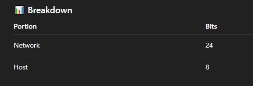

---

### 🏷️ 8. What Is CIDR?

#### 📌 CIDR = Classless Inter-Domain Routing

#### CIDR removes fixed classes (A, B, C).

#### Example: 192.168.1.0/26

#### 📌 /26 means:

- #### 26 bits for network
- #### 6 bits for hosts

#### CIDR gives:

- Better IP utilization
- Flexible subnetting

---

### ✂️ 9. Why Subnetting?

#### Subnetting means dividing one network into smaller networks.

#### 🧠 Why We Need It?

- Reduce broadcast traffic 🚦
- Better security 🔐
- Efficient IP usage 📈
- Logical network design 🧩

#### 🧸 Kid Example

- Big classroom → too noisy
- Split into small classrooms → peaceful 😄

---

### 🛠️ 10. Subnetting – Step by Step

#### 🎯 Example:

- Network: 192.168.1.0/24
- Need: 4 subnets

#### Step 1: Calculate Required Bits

- 2ⁿ ≥ number of subnets
- 2² = 4
- 👉 Borrow 2 bits

---

#### Step 2: New Subnet Mask

- /24 + 2 = /26

#### Subnet Mask: 255.255.255.192

#### Step 3 : Block Size

- #### 256 - 192 = 64

---

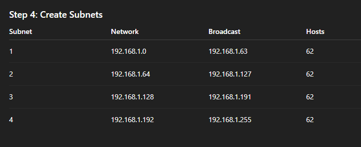

---

---

## One network splitting into 4 smaller networks real-world use case. (Only through diagram for better understanding)

### Step 1 : Company's block of 256 addresses.

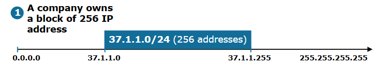

---

### Step 2 : Subnetting based on number of hosts

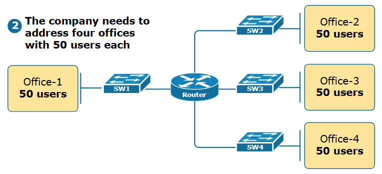

---

### Step 3 : What is Subnetting?

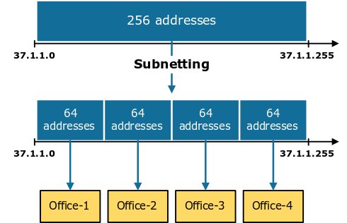

---

### Step 4 : The Subnetting Process

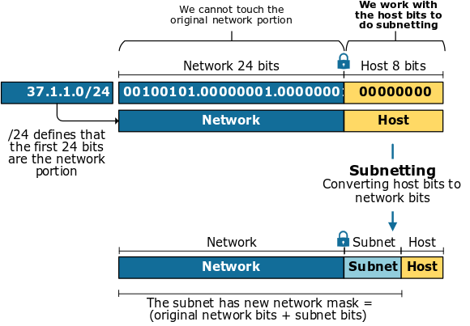

---

### Step 5 : The Subnetting Example

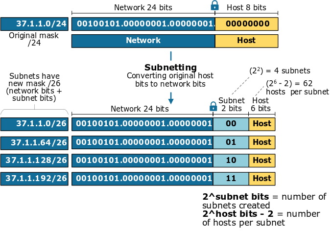

---

### Step 6 : Assigning an IP Network to each office

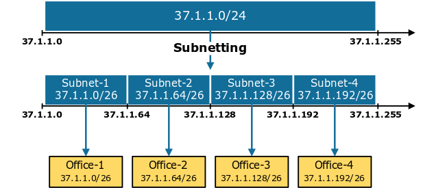

---

#### ⚡ 11. Easiest Way to Calculate Subnets & Hosts

#### 🧠 Shortcut Formula

#### Hosts per subnet: 2^(host bits) - 2

#### Number of subnets: 2^(borrowed bits)

#### Example: /26 → Host bits = 6, Hosts = 2⁶ - 2 = 62

---

---

### 🎯 Final Summary

- 🌍 IP address identifies devices
- 🔢 Networking uses binary math
- 🧩 IPv4 and IPv6 have different structures
- ✂️ Subnetting improves efficiency
- 🧠 CIDR gives flexibility
- ⚡ Subnetting can be calculated easily with practice
