# 🔥 Firewall Fundamentals & Linux iptables Guide

### 📌 Overview

#### Firewalls used in real-world environments broadly fall into open-source and commercial (paid) categories. Among these, Linux-based open-source firewalls are highly recommended because they are:

- Cost-effective (often completely free)
- Enterprise-grade and production-ready
- Capable of handling industry-level workloads
- Flexible, powerful, and widely adopted

#### This document focuses on understanding firewall concepts, traffic filtering directions, and Layer 2/3/4 blocking, with a strong emphasis on Linux Netfilter / iptables.

---

# 🧱 Firewall Introduction

### 🔐 What is a Firewall?

#### A firewall is a security system that monitors, permits, or blocks network traffic based on predefined security rules. Its primary objective is to prevent unauthorized communication while allowing legitimate traffic.

#### In Linux systems, firewall functionality is implemented using Netfilter, with iptables acting as the user-space utility.

### ✅ Key Characteristics of iptables

- Open-source
- Zero licensing cost
- Stateful packet inspection
- Highly configurable and scriptable
- Trusted in enterprise and cloud environments

---

### 🧰 Available Firewall Solutions

---

#### 1️⃣ Cisco ASA (Adaptive Security Appliance)

- Hardware-based firewall
- Expensive licensing and maintenance
- Requires expert-level configuration
- Common in large enterprises

#### 2️⃣ Check Point Firewall

- Hardware appliance
- High fixed and variable costs
- Requires certified professionals
- Enterprise-grade security features

#### 3️⃣ Microsoft ISA Server

- Windows Server-based firewall
- High OS and licensing costs
- Largely deprecated and rarely used today

#### 4️⃣ Linux Netfilter / iptables Firewall ⭐

- Free and open-source
- Requires Linux knowledge only
- Low maintenance cost
- Extremely flexible and widely used

---

---

# 🧠 Firewall Functional Types

#### Firewall types are classified based on how they handle traffic.

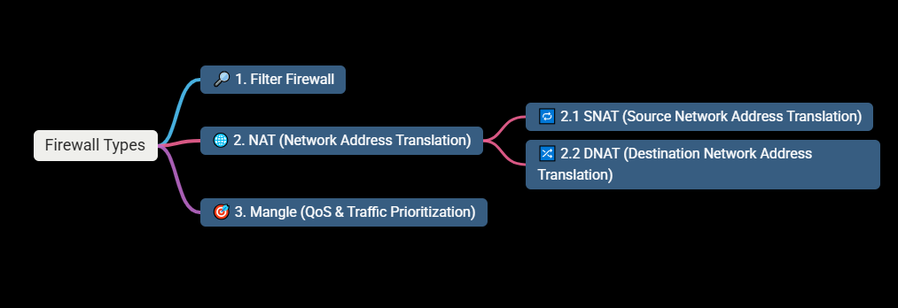

---

#### 🔎 1. Filter Firewall

#### Used to allow or block traffic based on:

- IP addresses
- Ports
- Protocols (e.g., SSH, Telnet, HTTP)

#### This is the most basic and commonly used firewall functionality.

---

#### 🌐 2. NAT (Network Address Translation)

#### NAT allows private networks to communicate with public networks securely.

#### 🔁 2.1 SNAT (Source Network Address Translation)

- Used for outgoing traffic from private networks
- Private IP addresses are never exposed to the Internet
- Firewall converts private IP → public IP

#### Real-life analogy: 📱 Outgoing calls from a SIM card (you can call outside, but incoming is restricted)

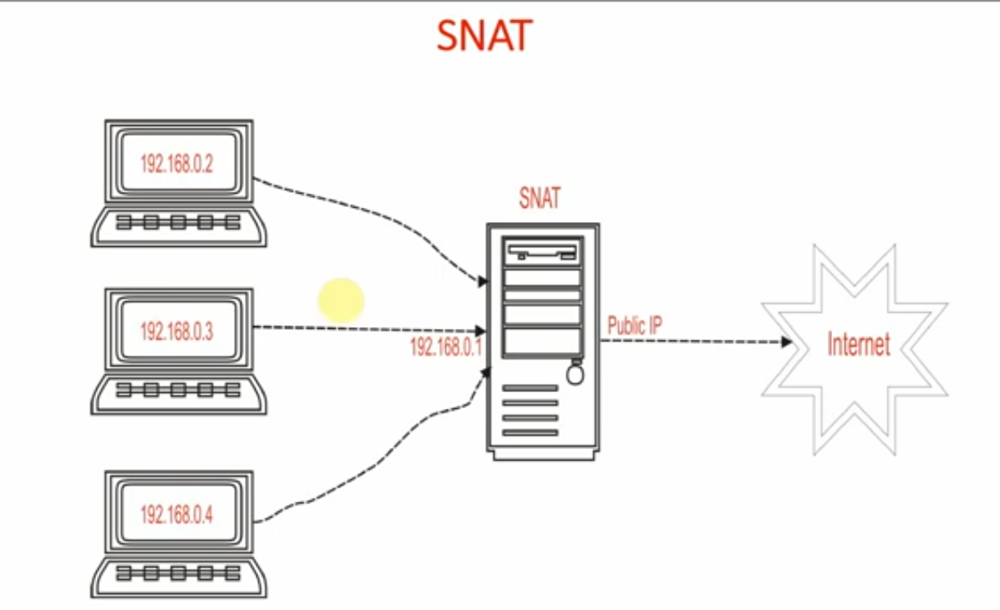

---

#### 🔀 2.2 DNAT (Destination Network Address Translation)

- Used for incoming traffic from the Internet
- Public IP traffic is redirected to an internal server
- Commonly used for web servers and application hosting

#### Real-life analogy: 🏢 Office address change notice at the main gate

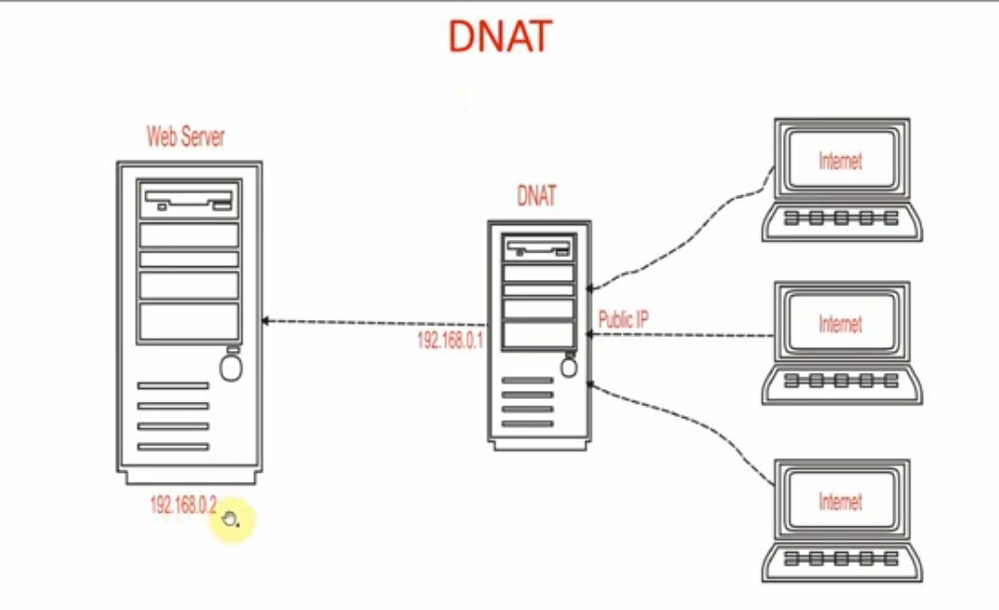

---

#### 🎯 3. Mangle (QoS & Traffic Prioritization)

- Used to modify packet attributes
- Assigns priority to important traffic
- Implements Quality of Service (QoS)

#### Real-life analogy: 🚓 VIP vehicle with a red beacon bypassing checkpoints

---

### 🧭 Firewall Traffic Direction

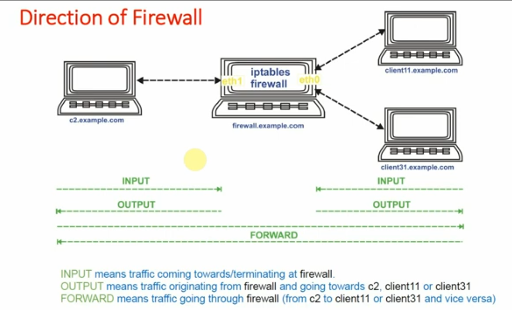

##### Firewalls inspect traffic based on direction relative to the firewall itself.

### 📥 INPUT

##### Traffic coming to or terminating at the firewall

### 📤 OUTPUT

##### Traffic originating from the firewall

### 🔄 FORWARD

#### Traffic passing through the firewall (source → destination

### 🌍 Direction Explained with Real-Life Example

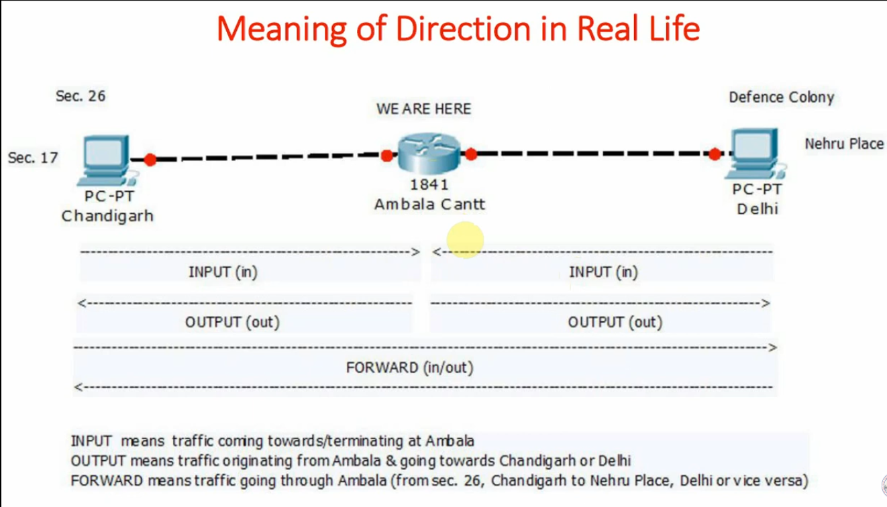

#### INPUT: Traffic coming toward Ambala

#### OUTPUT: Traffic originating from Ambala

#### FORWARD: Traffic passing through Ambala between Chandigarh and Delhi

---

---

### 🚫 What Can a Firewall Block or Permit?

#### Firewalls can filter traffic at multiple OSI layers:

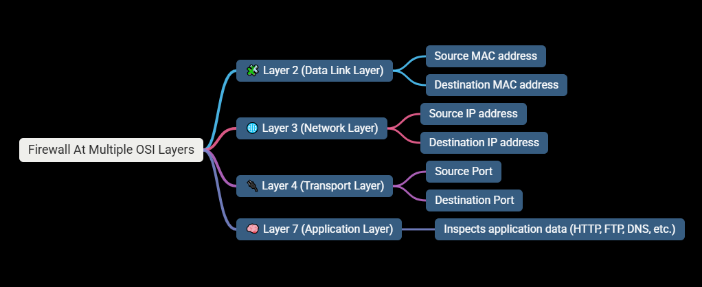

### 📦 Packet Structure & Firewall Visibility

#### Firewalls can inspect different packet components:

- SMAC → DMAC (Layer 2)
- SIP → DIP (Layer 3)
- SPORT → DPORT (Layer 4)
- Payload / Data (Layer 7)

---

---

# 🏁 Conclusion

#### Linux iptables provides enterprise-level firewall capabilities without licensing costs. By understanding firewall types, traffic direction, NAT, and OSI-layer filtering, administrators can design secure and efficient network architectures.

---

---

# 🧪 Hands-on iptables Labs (Step-by-Step)

#### 🔹 Lab 1: Allow SSH from a Trusted IP

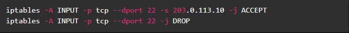

#### 🔹 Lab 2: Block Telnet Completely

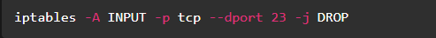

#### 🔹 Lab 3: Allow Outbound Internet Access (SNAT)

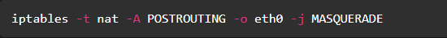

#### 🔹 Lab 4: DNAT for Web Server (Port Forwarding)

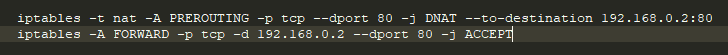

---

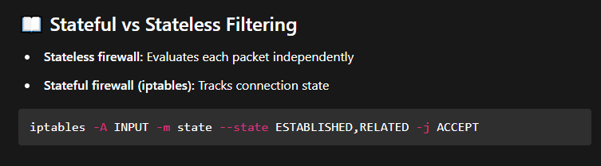

---

---

### ☁️ Mapping Firewall Concepts to Google Cloud (GCP)

#### 🔐 Google Cloud Firewall Overview

#### Google Cloud uses VPC Firewall Rules, which are:

- Stateful by default
- Applied at the VPC network level
- Direction-based (INGRESS / EGRESS)

---

### iptables v/s Google cloud Firewall Mapping.

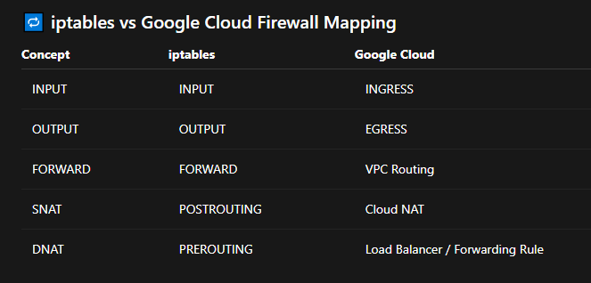

---

### 🌐 SNAT in Google Cloud (Cloud NAT)

- Private VM instances access the Internet
- No public IP required on VM
- Managed, scalable, secure

#### Use case: OS package updates, outbound APIs

### 🔀 DNAT in Google Cloud

#### Implemented using:

- External HTTP(S) Load Balancer
- TCP/UDP Load Balancer

#### Flow: Internet → Public IP → Load Balancer → Backend VM

---

### Final Summary

- #### Firewalls control traffic based on direction and OSI layers
- #### iptables is a stateful, Layer 2–7 capable firewall
- #### SNAT = outbound Internet access
- #### DNAT = inbound service exposure
- #### Google Cloud abstracts firewall logic using managed services
