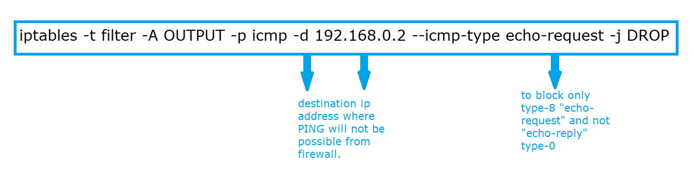
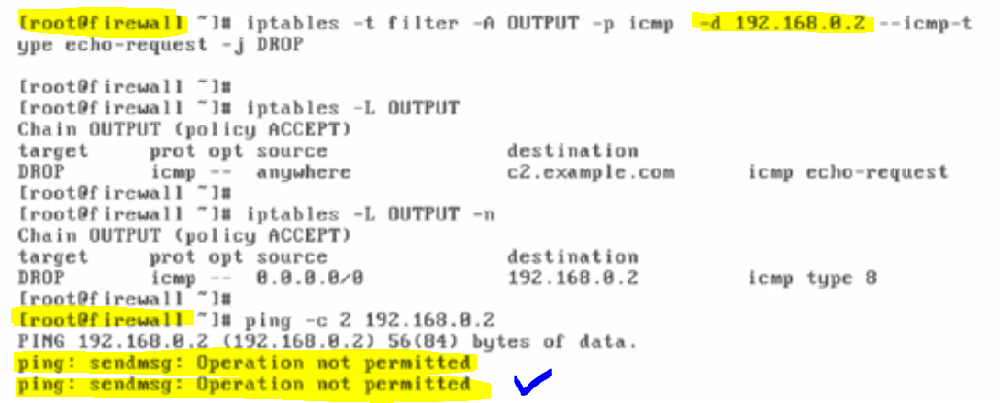
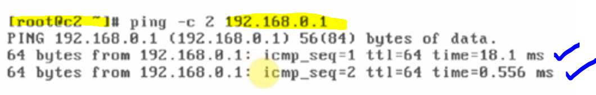
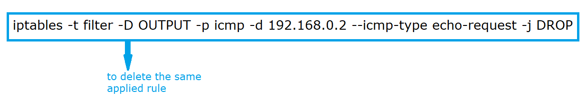
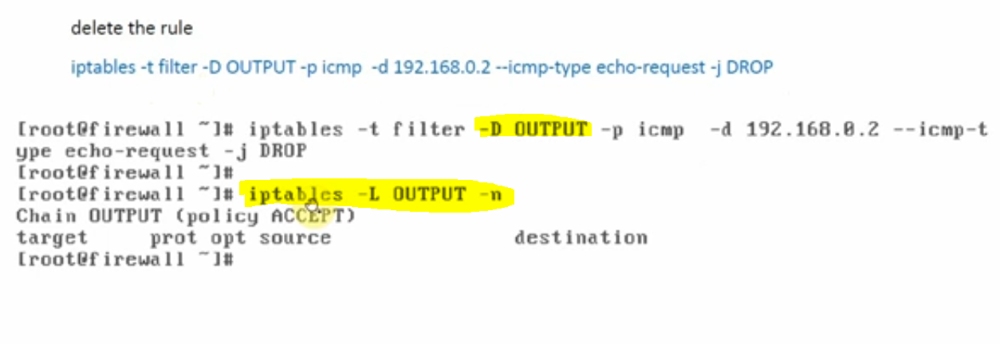

# Using OUTPUT Chain (output direction, owner module)

### We will be using the following archtiecture to see all the scenarios regarding OUTPUT chain.

---

#### Generally, the traffic is going out from firewall to other machines and we will control the output by using the same.

#### when we want to control the traffic originating from "firewall", we've to use OUTPUT chain.

#### Task-1 : We've vipin user on firewall, and vipin user should not be able to use "ssh" from "firewall" to any other machine in the network.

#### vipin and anantika are two users on firewall and we will perform action before applying rule to check that these two users can make the ssh connection with client "c2"

#### Here, we will open both users in different shells and we will check the SSH connections for both users to client "c2" where client "c2" have another user called aanya.

##### 1. checking vipin to aanya connection (firewall to c2 for user-1)

##### 2. checking anantika to aanya connection (firewall to c2 for user-2)

---

##### hence, both users successfully connected from firewall to "c2" client using SSH connection.

#### we can apply the OUTPUT chain rule on vipin user to do not access any machine through SSH connection, for this scenario we use OUTPUT chain rule and vipin user id = 500, if you observe in above image where vipin has the uid = 500

#### if you do not mention any -t filter (i.e the type of the firewall) then it is to be considered filter firewall type by default.

---

#### We've now checked the things for vipin and anantika SSH connection after applying the OUTPUT chain rule.

#### The user Vipin can not make SSH connection to user aanya on client "c2", however, from the same firewall machine, user aanantika making SSH connection towards aanya on "c2". Here our scenario is successful.

#### Note: in this case user VIPIN can easily PING to any other machines in the network because PING or respective rule policies does not include any user related information.

---

### Task-2: The firewall machine should not make a PING request to any other client machine in any network.

#### when we're using PING, we are sending "echo-request" (type-8) type of "ICMP" packets and in return we are getting "echo-reply" (type-0) "ICMP" packets.

#### block "echo-request" ICMP packets originating from "firewall" and going towards "192.168.0.2", now firewall not able to ping "c2" but "c2" will be able to ping "firewall"

---

#### however, from client "c2" to firewall, PING is successful.

---

#### To delete the rule, we use following command

#### Delete rule check.

---

#### We will cover the task-3 as just by observing the rules: here, in this case we only have rules and explanation and not any in depth images, just observing the rules and their flow explanation.

### 1. how to block web-access (http)

- iptables -t filter -A output -p tcp -d 172.24.0.11 --dport 80 -j DROP

(block web-access from "firewall" on "172.24.0.11", now firewall will not be able to access the web-server on client11,
however, the request from client 11 and client 31 will be able to access the firewall, web-access.
)

### 2. how to block from all source ports to firewall

- iptables -t fileter -A OUTPUT -p tcp --sport 80 -j DROP

- source port 80 has been blocked by the above command.
- Firewall to client11 (traffic has no problem and successful)
- From client 11,31 and c2 to firewall (traffic will not flow)

### 3. how to block web-access from a particular or specific ip

- ### iptables -t filter -A OUTPUT -p tcp -d 172.24.0.11 --sport 80 -j DROP

- From firewall to client 11, web-access (http) is possible.
- From client 11 to firewall, web-access (http) is not possible or denied
- From client 31 to firewall , web-access (http) is possible.
