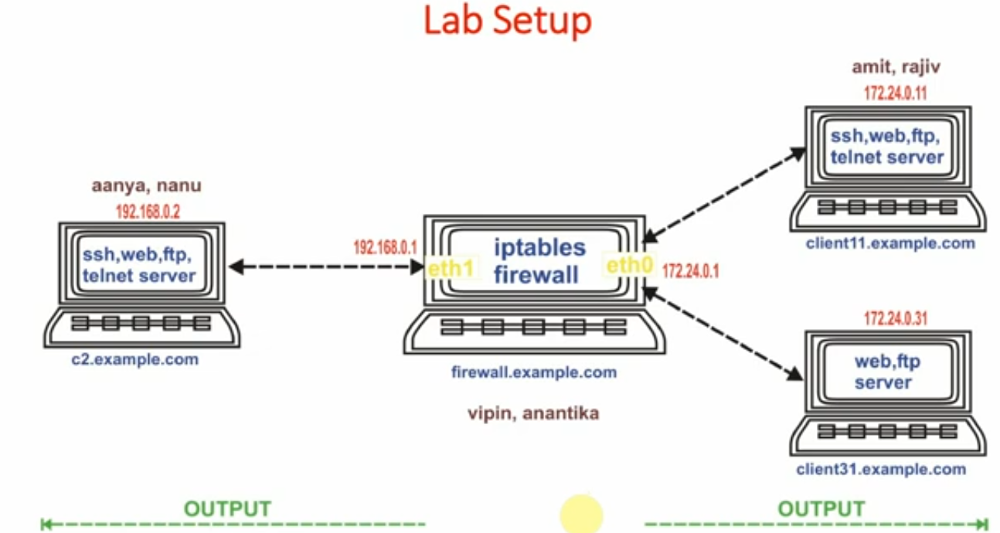
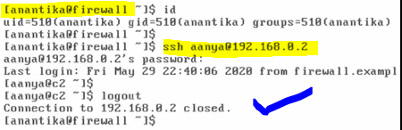
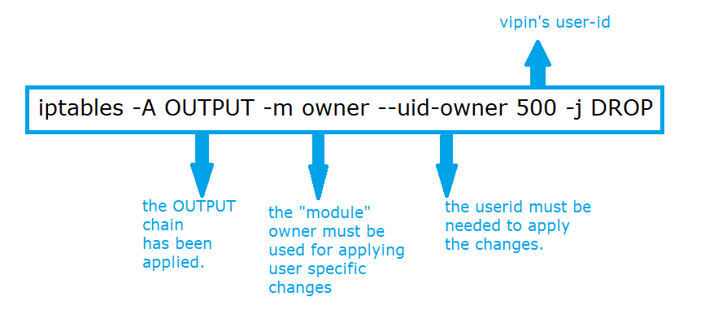
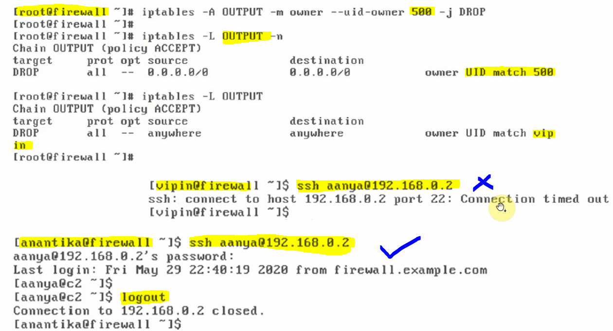

# Using OUTPUT Chain (output direction, owner module)

### We will be using the following archtiecture to see all the scenarios regarding OUTPUT chain.

---

#### Generally, the traffic is going out from firewall to other machines and we will control the output by using the same.

#### when we want to control the traffic originating from "firewall", we've to use OUTPUT chain.

#### Task-1 : We've vipin user on firewall, and vipin user should not be able to use "ssh" from "firewall" to any other machine in the network.

#### vipin and anantika are two users on firewall and we will perform action before applying rule to check that these two users can make the ssh connection with client "c2"

#### Here, we will open both users in different shells and we will check the SSH connections for both users to client "c2" where client "c2" have another user called aanya.

##### 1. checking vipin to aanya connection (firewall to c2 for user-1)

##### 2. checking anantika to aanya connection (firewall to c2 for user-2)

---

##### hence, both users successfully connected from firewall to "c2" client using SSH connection.

#### we can apply the OUTPUT chain rule on vipin user to do not access any machine through SSH connection, for this scenario we use OUTPUT chain rule and vipin user id = 500, if you observe in above image where vipin has the uid = 500

#### if you do not mention any -t filter (i.e the type of the firewall) then it is to be considered filter firewall type by default.

---

#### We've now checked the things for vipin and anantika SSH connection after applying the OUTPUT chain rule.

#### The user Vipin can not make SSH connection to user aanya on client "c2", however, from the same firewall machine, user aanantika making SSH connection towards aanya on "c2". Here our scenario is successful.

#### Note: in this case user VIPIN can easily PING to any other machines in the network because PING or respective rule policies does not include any user related information.
