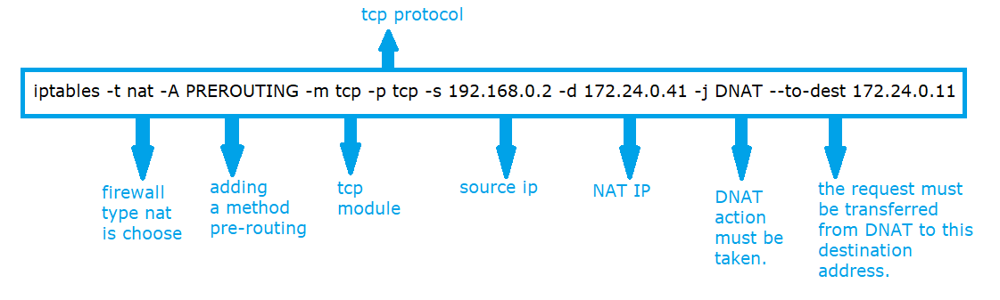
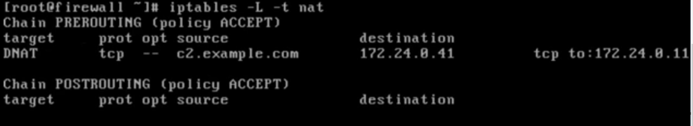
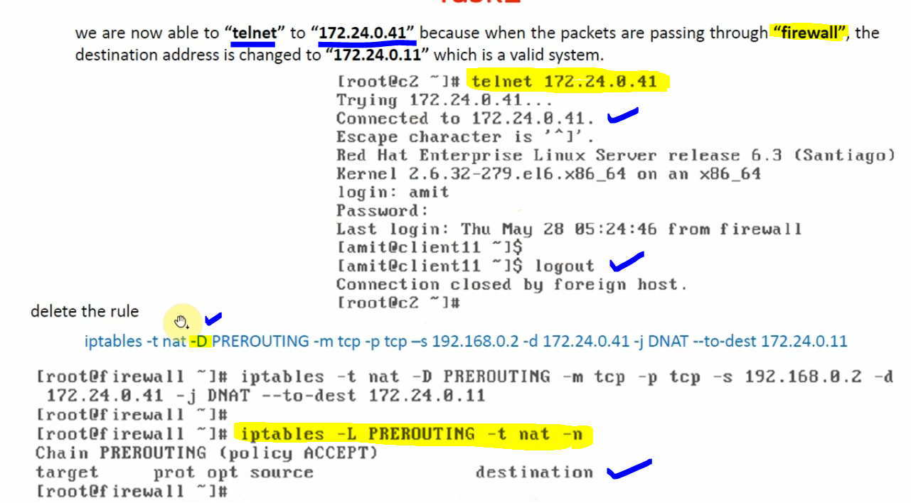

# Destination Network Address Translation (DNAT) using PREROUTING chain.

### Destination Network Address Translation (DNAT) is a networking technique that changes the destination IP address of incoming network packets to redirect them from a public IP to a specific private IP within a local network, allowing external users to access internal servers or services like web servers, essentially acting as port forwarding to make private resources accessible publicly.

### PRE-ROUTING means do it before routing, i.e change the address before routing.

#### This is for security purpose, let suppose we want to communicate from client c2 to client 11 through firewall. However, c2 can communicate with client 11 through it's own address 172.24.0.11 and not through 172.24.0.41 because 172.24.0.41 is not available and we pre-route this address (pre-configure) into the firewall therefore, the client 11 can bypass the request through 172.24.0.41.

#### For altering packets as they enter "Firewall", i.e before routing the decision is made.

### Applying DNAT Rule

#### Here, we change the destination address of packets coming from "192.168.0.2" and going towards "172.24.0.41" to achieve target ip / destination ip "172.24.0.11" before routing decision.

#### Why? - Because our firewall is also acting as a router, routing decisions are taken based on destination address. In DNAT, we are changing the destination address, so recommend practice is PREROUTING chain with "DNAT" target. We have to choose "NAT" table, PRETOUTING chain and DNAT as target.

#### IP Table Rule

#### DNAT Apply and Delete

#### Note: Hence, we have proved that the Firewall is also one type of Router.
