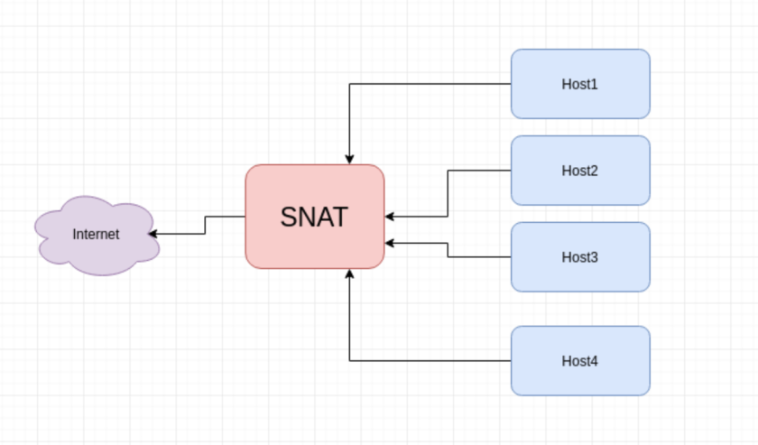
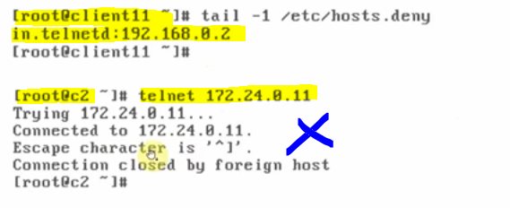
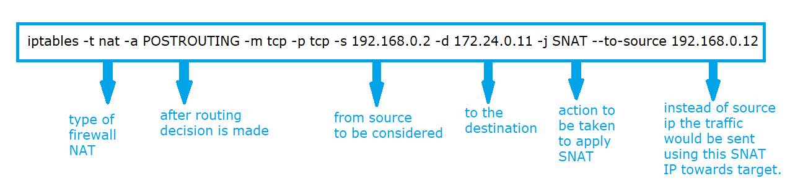
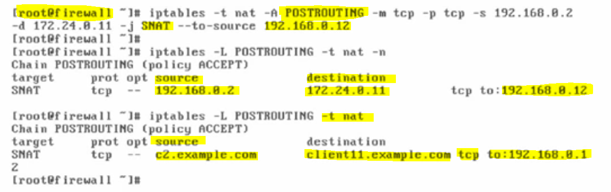
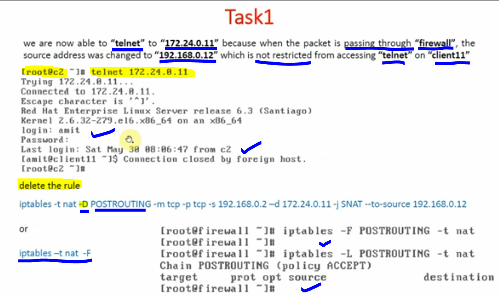

# SNAT (Source Network Address Translation)

### SNAT, or Source Network Address Translation, is a networking technique that changes the source IP address of outgoing network packets, typically from a private internal IP to a single public IP, allowing multiple private devices to share one public address for internet access, acting like your home router. It ensures replies come back correctly and is crucial for outbound connectivity.

---

### POSTROUTING SNAT (Source Network Address Translation) is an iptables/firewall technique that changes a packet's source IP address to a single public IP (like a router's) after the routing decision is made, but before the packet leaves the system, allowing multiple private devices to share one internet connection by making outbound traffic appear to come from the router's IP

---

### Lab setup

#### Here, when request goes from Source IP Address from client "c2" towards client "11" through firewall, the firewall changes the "c2" ip after making a request by applying POSTROUTING IP Address such as "192.168.0.12", this translated address from client "c2" would be considered as Public IP for client "c2"

#### on client "c11", edit "/etc/host.deny" file and add the line

- "in.telnetd:192.168.0.2", i.e we are restricting client "c2" (192.168.0.2) from accessing telnet server on client "11"

## 

#### to bypass, this restriction, we want to change the source address of the packet from "192.168.0.2" to some address (192.168.0.12) which is not restricted. For altering packets as they leave "firewall", that is after routing decision is made.

#### change the source address of the packets going towards 172.24.0.11 to 192.168.0.12 after routing. For this we have to use NAT table, "POSTROUTING" as a CHAIN and SNAT as a target.

---

#### Verification:

---
