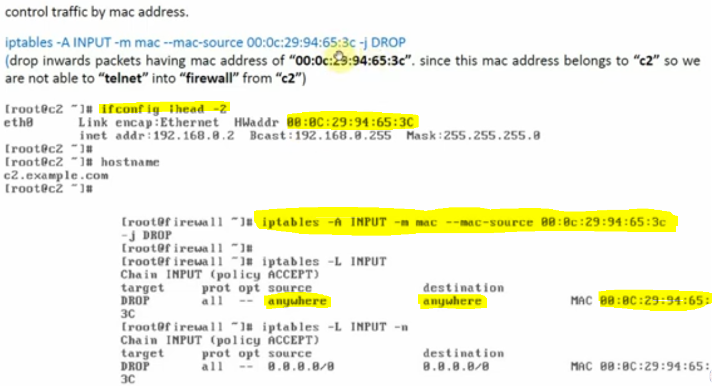
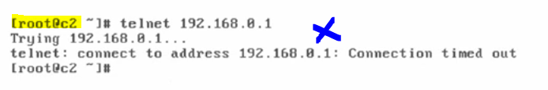

# MAC Addressed Based Filtering.

### We will control traffic by using MAC addresses and this is Layer-2 level filtering.

#### Using INPUT chain

#### Task-1 : INPUT chain MAC address filtering.

- We will drop the inward packets having MAC address of "00:0c:29:94:65:
  3C", this MAC address belongs to "c2" so we are not able to telnet into "firewall" from "c2"

#### telnet to firewall from "c2" machine (blocked)

#### how to delete

