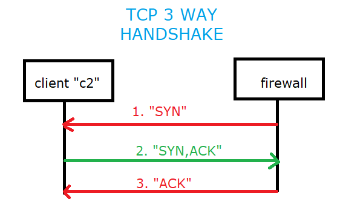
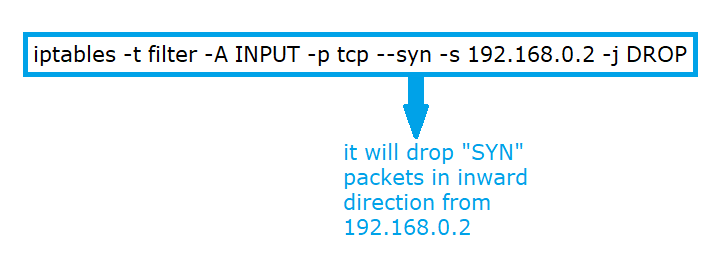
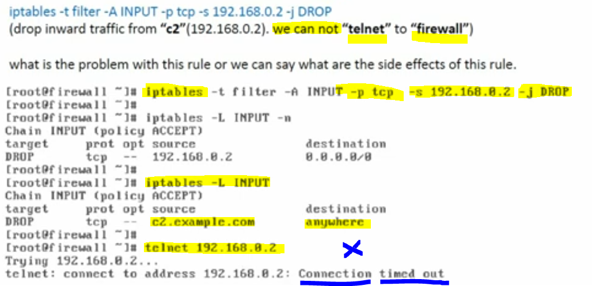
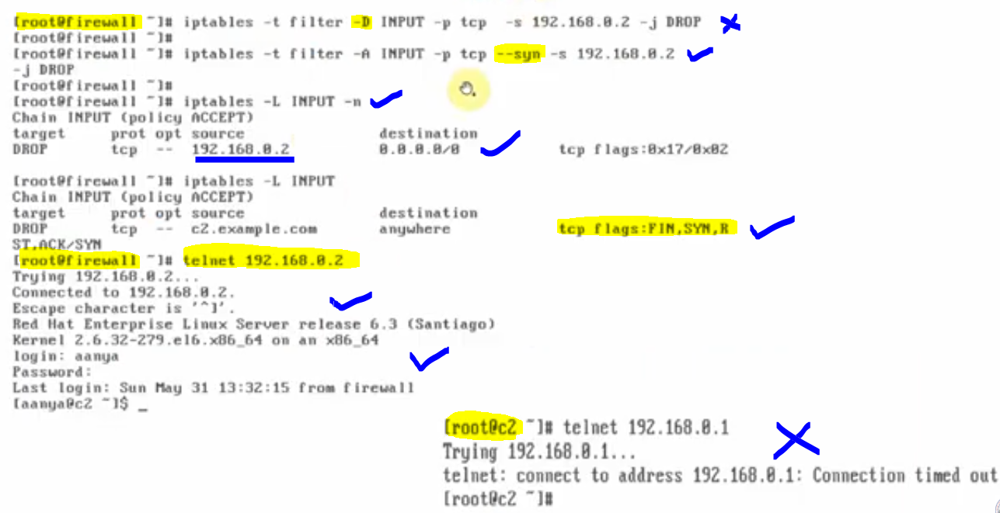

# How to block TCP SYN packets in IP tables firewall

### In TCP the communication always happends in a 3 way handshake

#### We drop inward traffic from client "c2" (192.168.0.2) , we can not "telnet" to "firewall"

#### what is the problem with this rule or we can say what are the side effects of this rule?

#### From firewall if we want to telnet "c2" then we are not able to do so, why?

#### For this we need to understand the 3 way TCP handshake that takes place during TCP connections.

#### The 3 stages would be

- "firewall" sends "syn" packet to "c2"
- "c2" sends back "syn,ack" packet to "firewall"
- "firewall" sends "ack" packet to "c2"

#### Here, we did not mention which type of packets to drop, it is dropping all types of packets (syn, syn/ack and ack) in inward direction.

- #### When "c2" connects to "firewall", it sends "SYN" packet to firewall, which is blocked so no connection.

- #### when "firewall" connects to "c2", it sends "syn" packet, which is not blocked (no "OUTPUT" chain rule), "SYN,ACK" is returned back which is blocked. 3-way handshake is not completed, so no connection. However, this is what we do not want to achieve, so we need to perform direction filtering, in which we want to block the traffic in one direction only.

- #### Step 1 : we will delete the previous rule and add modified rule in "INPUT" chain.

- #### Modified Rule:

  

- #### and hence the above rule, will drop the "SYN" packets in inward direction from "192.168.0.2", we will be now able to connect from "firewall" to "c2"

---

#### First Rule Applied

## 

#### We will remove the first rule applied and then we will add our second rule from which "firewall" can easily telnet "c2" machine.

