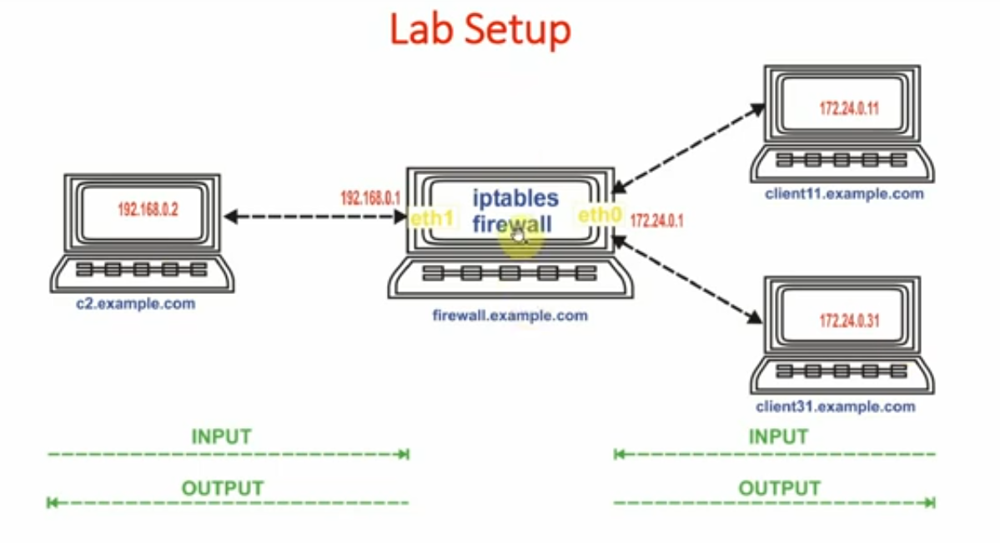
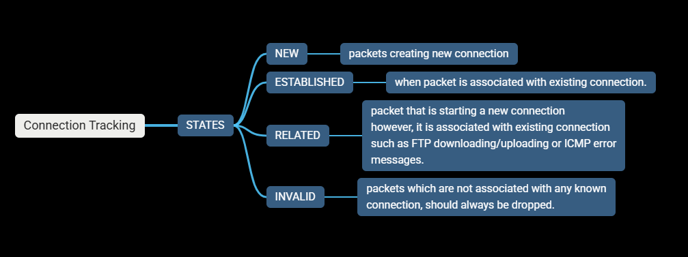
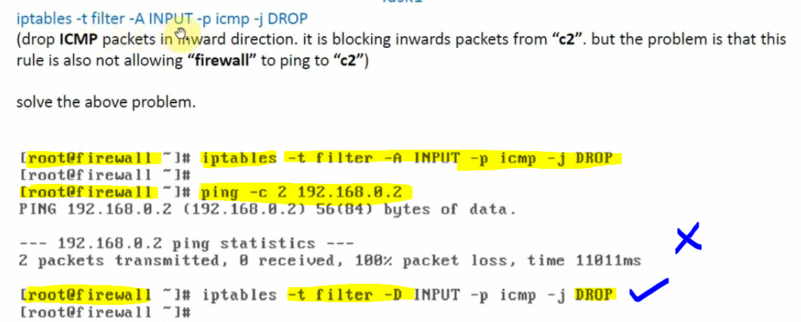
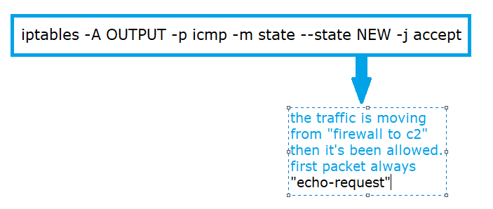
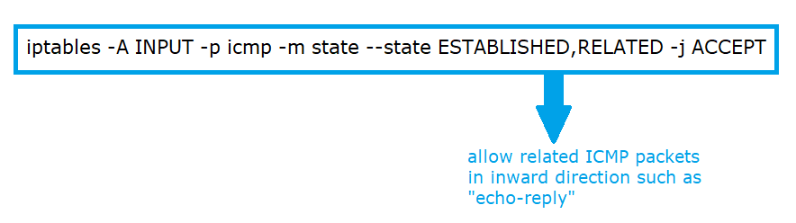
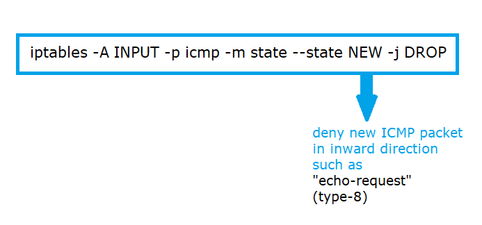
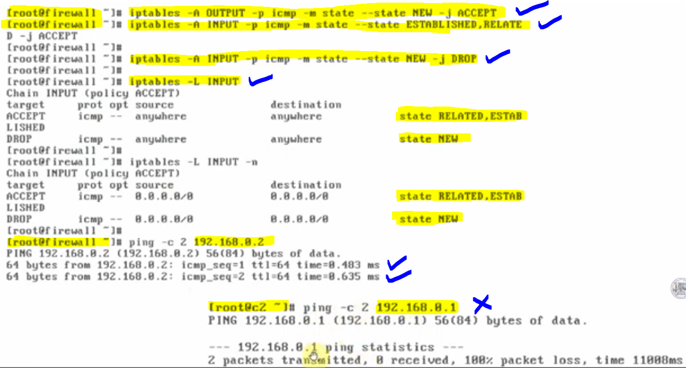

# Problems in Stateless Firewall

### Lab Setup in both direction INPUT and OUTPUT as follows

---

### What is connection tracking?

##### The connection information is kept in memory, for this we have to use "state" module and there can be 4 states.

#### Task-1: We will drop ICMP packets in inward direction, it is blocking inward packets from "c2", but the problem is that this rule is also not allowing "firewall" to ping "c2".

#### To solve the above problem:

- when we want to control the traffic coming towards "firewall", we have to use "INPUT" chain.
- when we want to control the traffic originating from "firewall", we have to use "OUTPUT" chain.

#### solution lies by using "connection" tracking module, we delete the previous applied rule and we will add the 3 new rules, one in "OUTPUT" chain, and two in "INPUT" chain.

#### Stateful firewall:

- #### 1. Allow new ICMP packets in outward direction such as "echo-request"

## 

- #### 2. If the first packet goes outside then, obviously, the "echo-reply" would be formed in the reaction of "echo-request". Hence, the first packet is connected with second packet and also it is established too.

## 

- #### 3. when someone wants to connect again from "c2" to "firewall" the new connection will be formed. That means the traffic from outside towards the firewall would not be allowed.

## 

### Note: From now, we are able to ping outwards from the "firewall" however, inward PING to "firewall" is blocked.

#### Verification:

- The "firewall" to "c2" connection is new (first requst allowed)
- Similarly, immediately attached request has obvious reply from "c2" machine and therefore, established and related reply would be allowed from "c2" machine to "firewall".
- However, direct PING from any machine outside the "firewall" would not be allowed because those would be considered as a NEW request from outside and we have already blocked that requests from outside towards "firewall".

---
