# 🌐 VMware Network Lab with iptables Firewall

### This document explains the network diagram step by step and shows how to build the same setup using VMware, Linux, and iptables. The explanation is simple, structured, and practical, so anyone can follow it comfortably.

#### Follow the below architecture diagram.

---

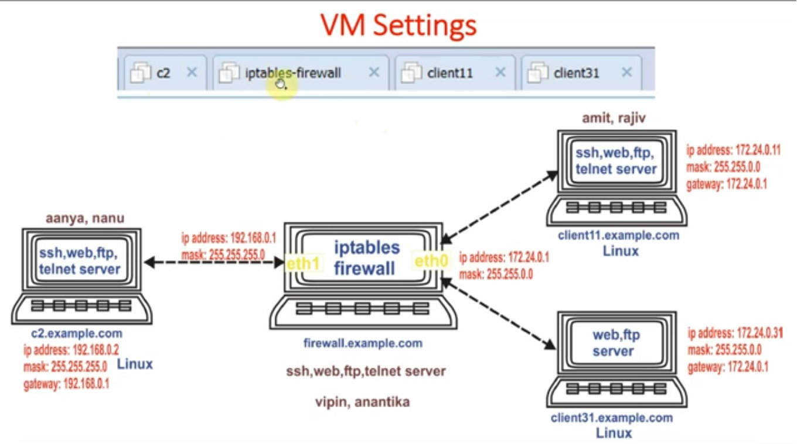

---

---

### 🧩 1. Understanding the Network Diagram

#### We have four virtual machines connected through one firewall machine.

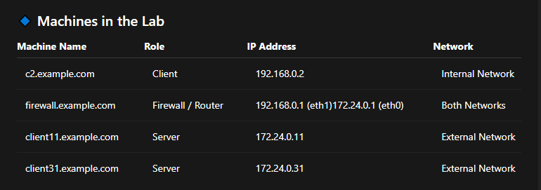

#### The firewall machine is the most important one. It connects two different networks and controls traffic between them.

---

### 🔌 2. Network Design (Polished Explanation)

#### 🏠 Internal Network (LAN)

- Network: 192.168.0.0/24
- Used by: c2.example.com
- Gateway: 192.168.0.1 (firewall eth1)

#### 🌍 External Network (DMZ)

- Network: 172.24.0.0/16
- Used by: client11 and client31
- Gateway: 172.24.0.1 (firewall eth0)

#### The firewall acts like a traffic police officer, deciding which packets can pass from one side to the other 🚦

---

### 🖥️ 3. VMware Network Configuration (Step by Step)

#### Step 1: Create Two Virtual Networks

##### In VMware Virtual Network Editor:

##### VMnet1 (Host-Only)

- Subnet: 192.168.0.0
- Used for internal machines

##### VMnet2 (Host-Only or Custom)

- Subnet: 172.24.0.0
- Used for external servers

---

### Step 2: Assign Network Adapters

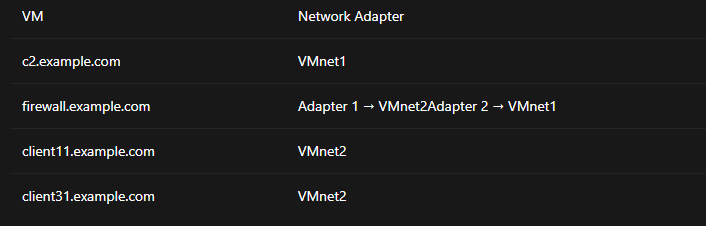

---

### ⚙️ 4. IP Configuration on Each Machine

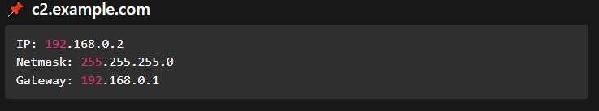

---

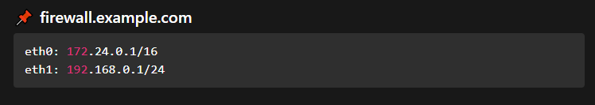

---

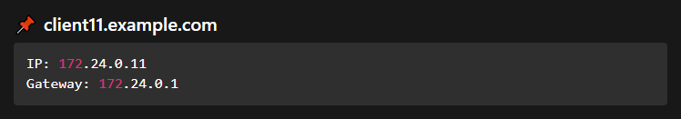

---

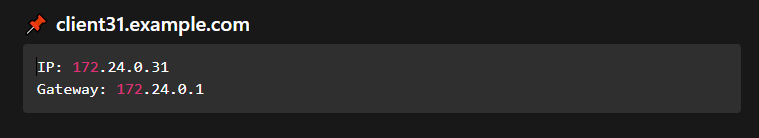

---

### Configuration on All Machine for /etc/hosts file.

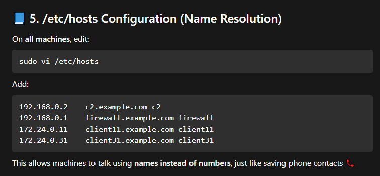

---

### How ping travels between machines

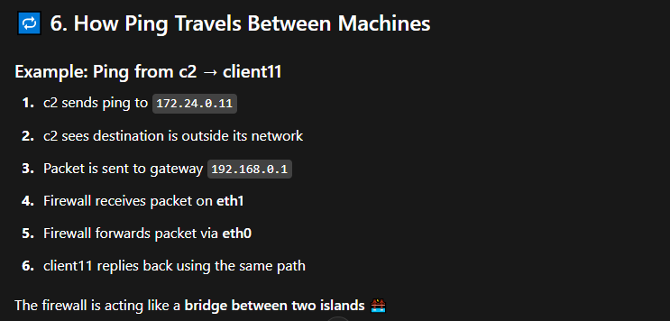

---

### 🔥 7. Enabling Routing on Firewall

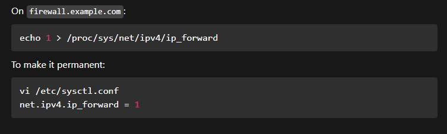

---

### 🛡️ 8. Basic iptables Configuration

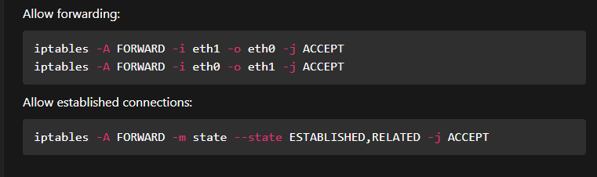

---

### 🌟 9. Services Provided by Servers

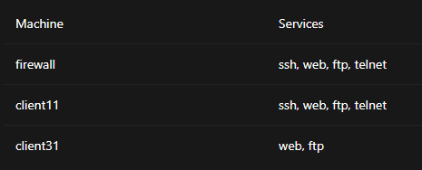

#### Each service is like a different door 🚪 on the server

---

### ✅ 10. Final Outcome

- ✔ Machines can communicate across networks
- ✔ Firewall controls traffic
- ✔ VMware simulates a real enterprise network
- ✔ Easy to test security rules

---

#### 🎉 Summary

#### This lab demonstrates:

- Multi-network routing
- Firewall with two NICs
- Name resolution using /etc/hosts
- Controlled communication using iptables

#### We've built a real-world firewall lab using VMware and Linux 🧠💻

---
