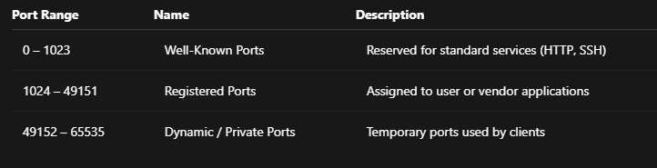
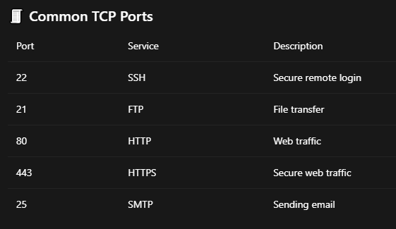
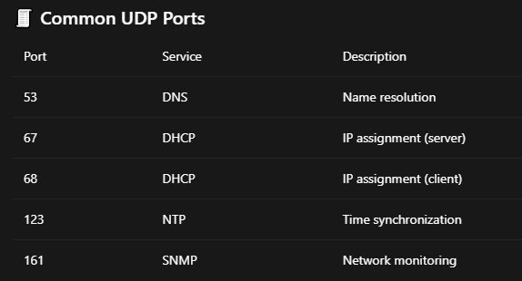
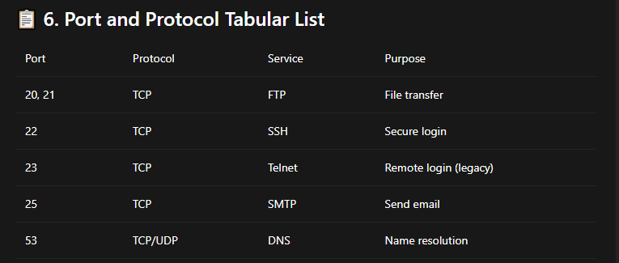
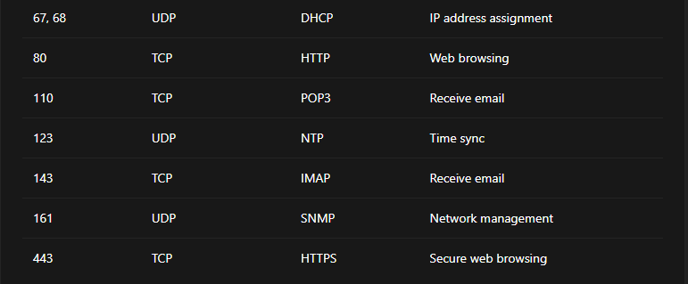

# 🔌 Understanding Ports, Protocols, and Connectivity

### This document explains what ports are, how port connectivity works, and how TCP and UDP ports are used. The explanation is simple, clear, and structured so that readers of all levels can understand it easily.

---

#### 🚪 1. What is a Port?

- A port is like a numbered door on a computer.
- The IP address tells which computer to reach 🖥️

#### The port number tells which application on that computer should receive the data 📦

---

#### 🧠 Simple Example

##### If a computer is an apartment building:

- IP address = building address 🏢
- Port = apartment door number 🚪
- Each service (web, email, file transfer) listens on a specific port.

---

#### 🔁 2. What is Port Connectivity?

##### Port connectivity means:

##### One machine can successfully send data to a specific port on another machine.

##### For port connectivity to work:

- The service must be running
- The port must be open
- The firewall must allow the connection

---

#### ✅ Example

- Browser → Port 80 → Web Server 🌐
- SSH Client → Port 22 → Linux Server 🔐

#### 📊 3. Port Number Ranges

#### Ports are numbered from 0 to 65535 and are divided into three ranges:

---

### 🌐 4. What are TCP and UDP?

#### 📦 TCP (Transmission Control Protocol)

- Reliable ✔️
- Connection-based 🔗
- Ensures data arrives in order
- Used when accuracy is important

#### 🚀 UDP (User Datagram Protocol)

- Faster ⚡
- No connection setup
- No delivery guarantee
- Used when speed is more important than accuracy

---

#### 🔢 5. Which Ports Use TCP and UDP?

##### Some services use TCP, some use UDP, and some use both.

---

---

---

### 🔐 7. Ports, Firewalls, and Security

- Open ports = open doors 🚪
- Closed ports = locked doors 🔒

#### Firewalls decide:

- Which ports are allowed
- Which protocols are permitted
- This helps protect systems from unauthorized access 🛡️

---

### 🎯 8. Final Summary

- Ports identify applications
- TCP focuses on reliability
- UDP focuses on speed
- Port ranges organize usage
- Firewalls control port access

#### Understanding ports and protocols is a core networking skill that helps in system administration, security, and troubleshooting 🚀
