# Checking Conenctivity between machines.

### Start with Client11 and Firewall

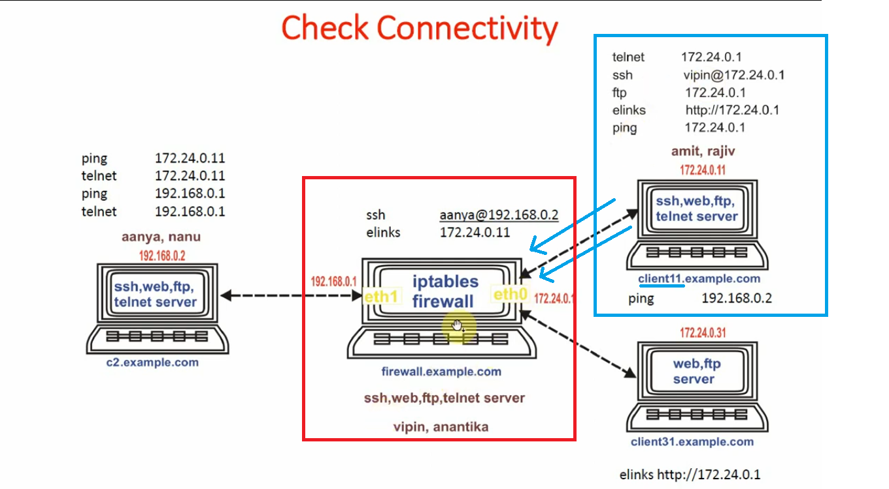

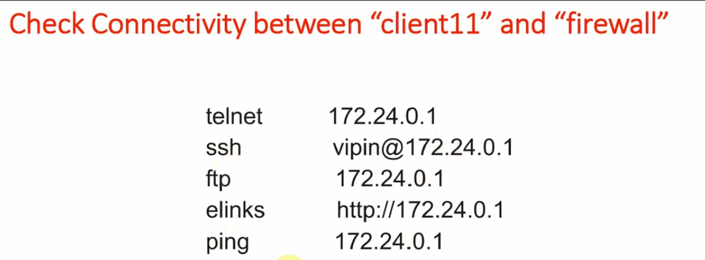

#### checking telent connectivity

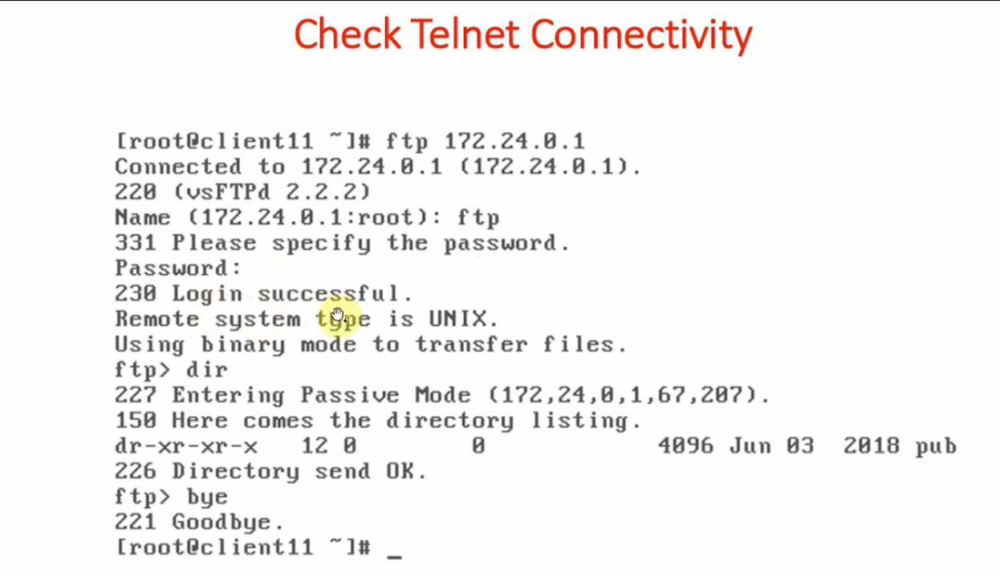

#### checking ssh connectivity

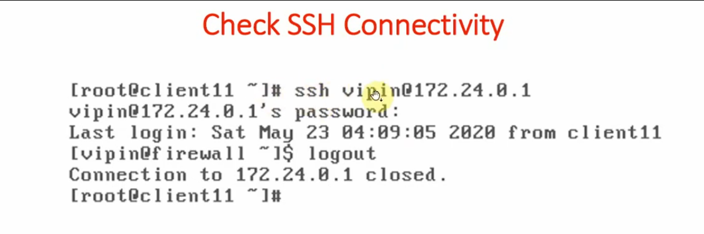

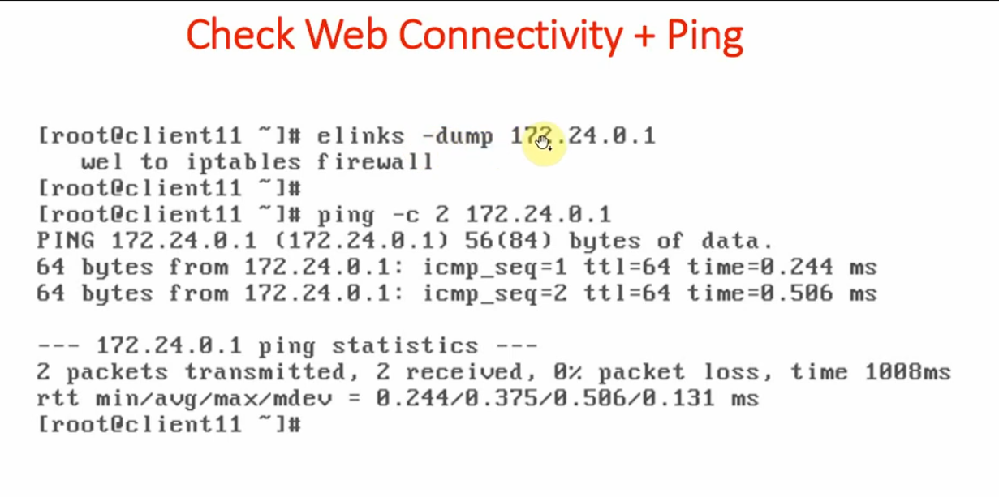

---

#### Checking connectivity between client 31 and firewall

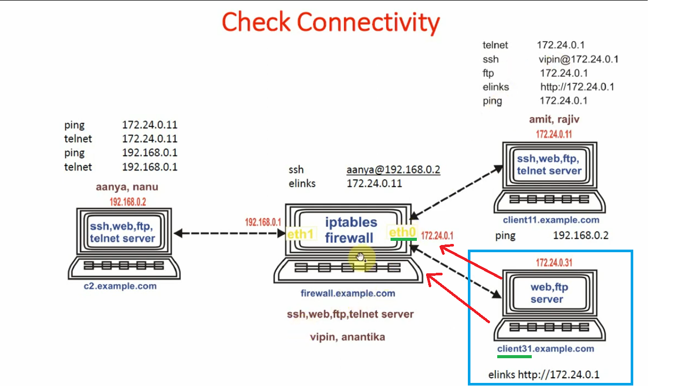

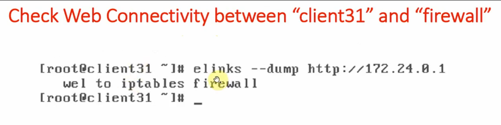

---

#### Checking connectivity from client11 to c2

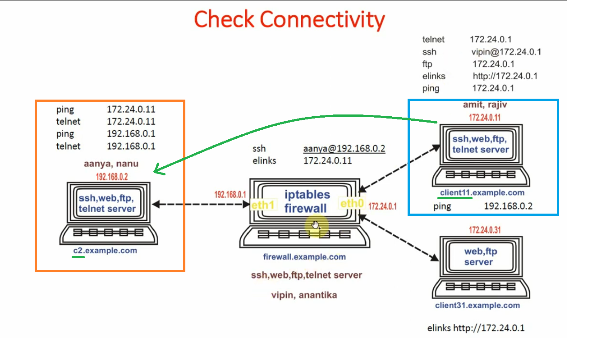

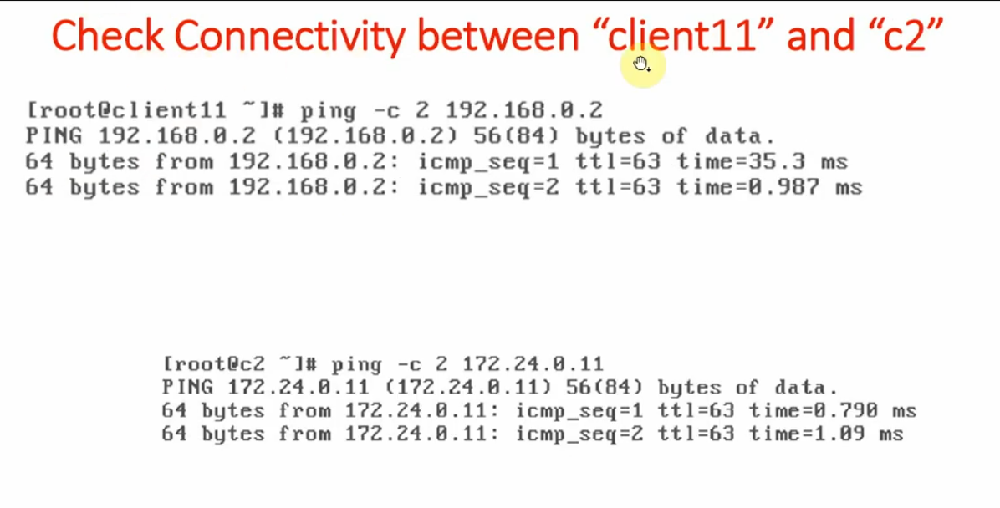

---

#### from c2 to client11 connectivity

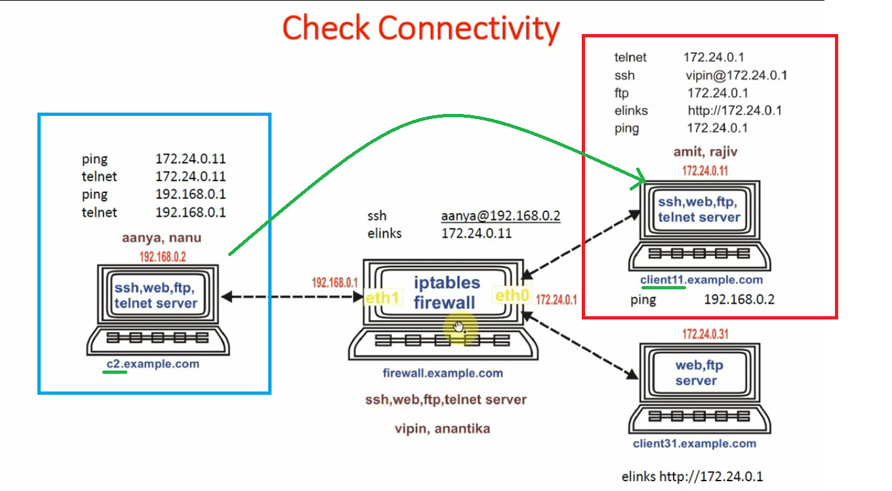

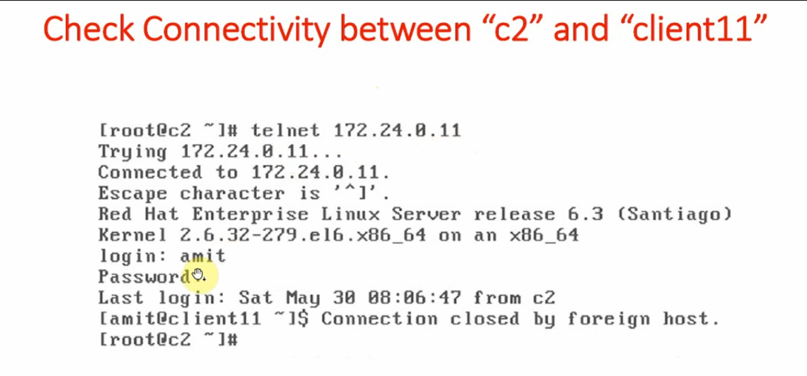

---

#### from Firewall to c2 and c11

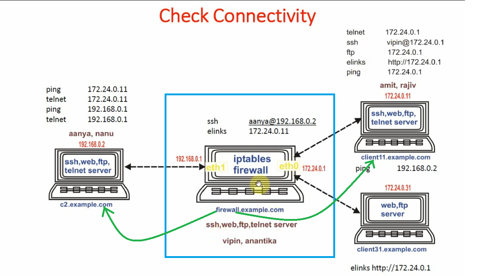

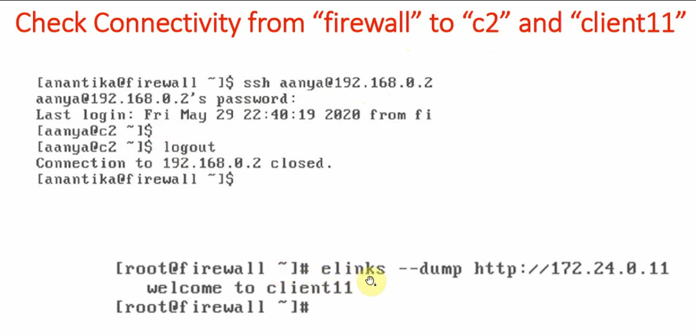

---

---

#### from c2 to firewall

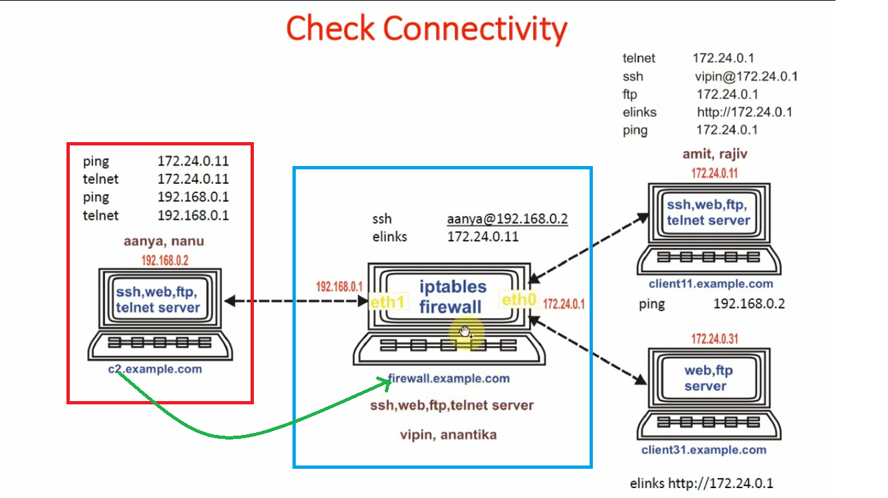

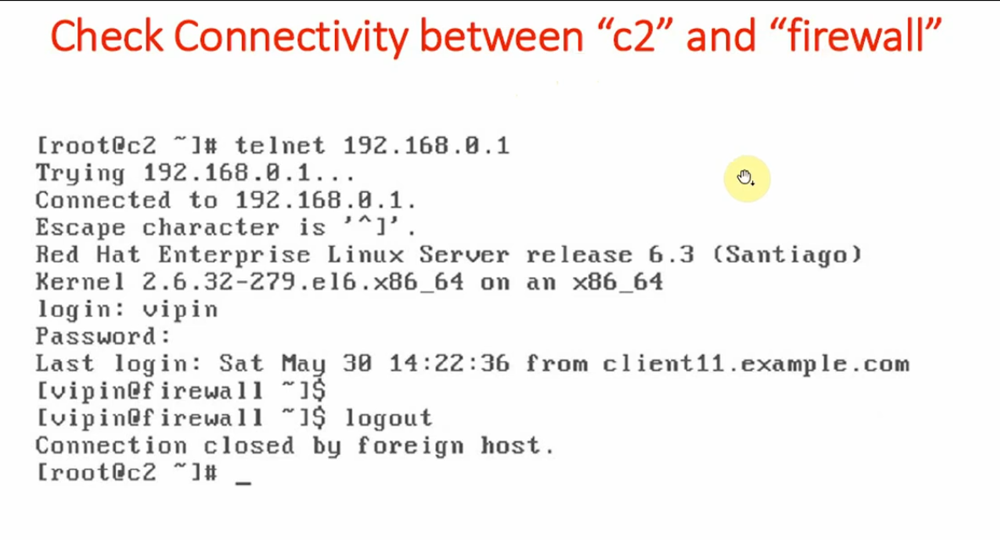
