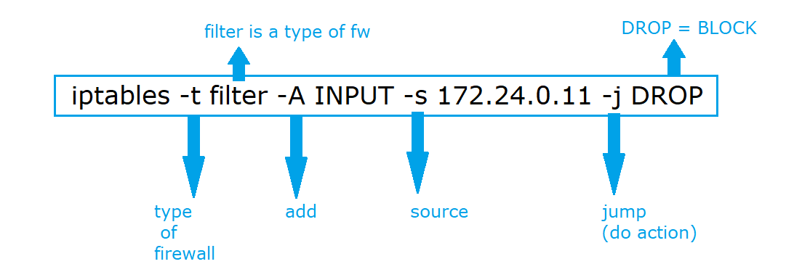
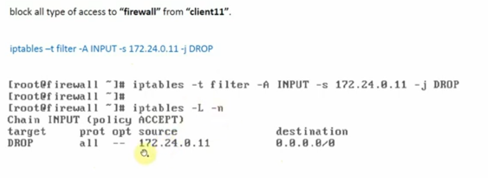
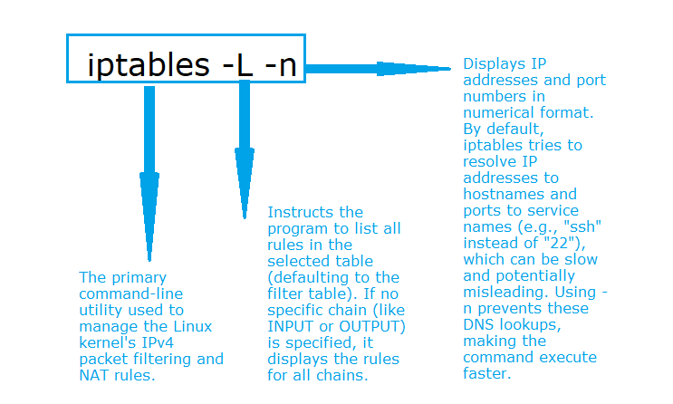
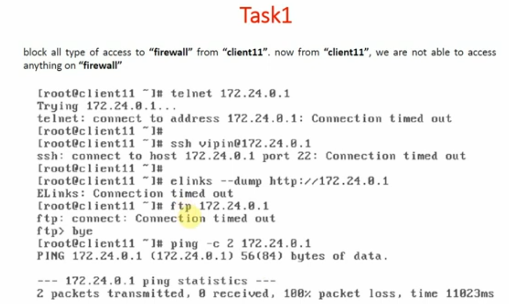

# Input Direction, for all services, Block Single Host, Network, Any IP

### Lab Setup Architecture

---

### Task 1:

#### Block all types of access to firewall from client11, that is from client11 we can not access anything on firewall.

- The client11 will not be able to access any services on the firewall (ssh,ftp,web,telnet server)

#### "we have to put the rule inside the firewall rule"

#### Rule:

## 

## 

#### To check the rule is applied perfectly or not, then we use the following command:

## 

### Verification:

---
