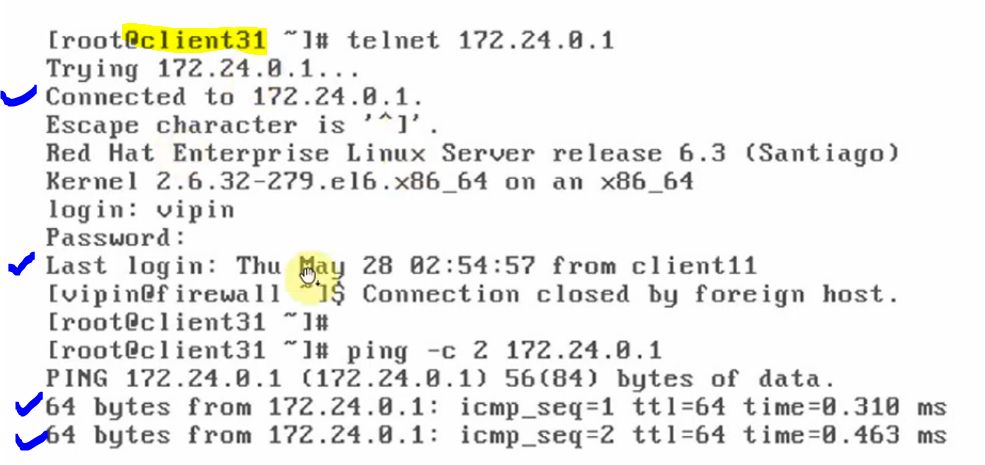
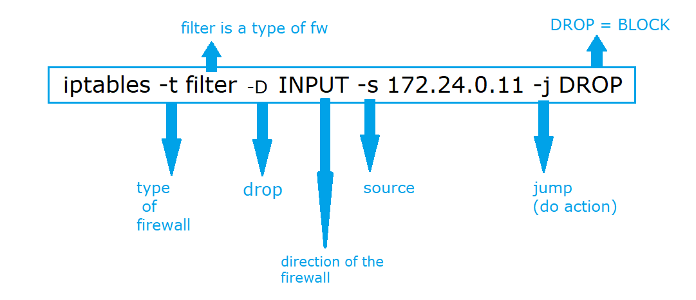
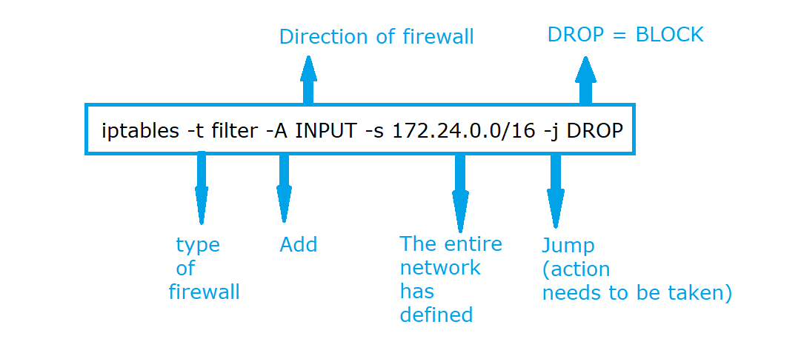
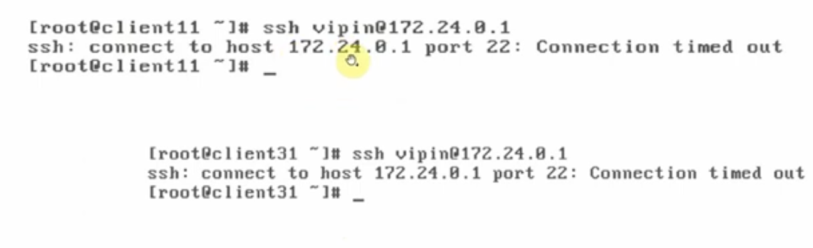
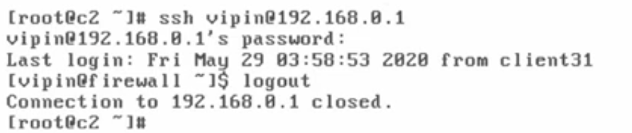
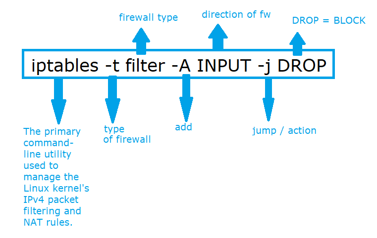
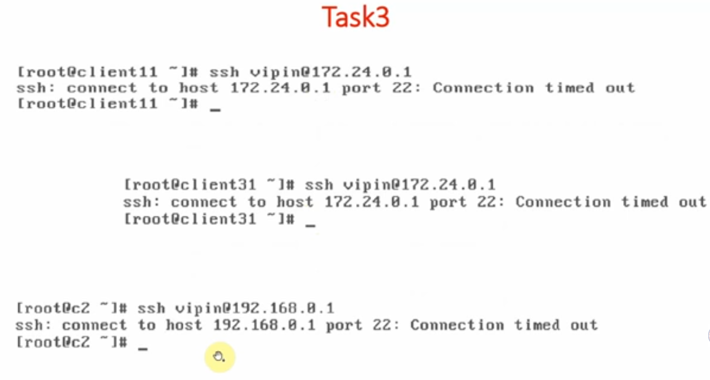
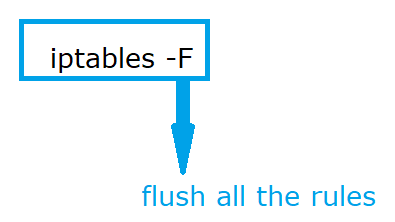

# Input Direction, for all services, Block Single Host, Network, Any IP

### Lab Setup Architecture

---

### Task 1:

#### Block all types of access to firewall from client11, that is from client11 we can not access anything on firewall.

- The client11 will not be able to access any services on the firewall (ssh,ftp,web,telnet server)

#### "we have to put the rule inside the firewall rule"

#### Rule:

## 

## 

#### To check the rule is applied perfectly or not, then we use the following command:

## 

### Verification:

## 

#### Checking connections from client31 machine

## 

#### How to remove the applied rule again?

#### "Instead of typing -A we will replace it with -D (for dropping the rule)"

## 

---

### Task 2:

#### Block all types of access to firewall from "172.24.0.0/16" network, that is from client11 and client31 we can not access anything on firewall.

## 

#### Checking the connection from client11 and client31 to the firewall.

## 

#### Verification from the Client c2 Machine going to be successful. It is a different network 192.168.0.0/24 and not the same 172.0.0.0/16 network.

## 

---

---

### Task 3:

#### Block all types of access to firewall from any ip, that is from "client11", "client31" or "c2" we can not access anything on firewall.

#### If you're not defining any source then it means, all inward traffic is blocked by firewall.

## 

### Verification: All networks been blocked and no network can access the services on firewall.

## 

#### to drop all the rules we use below command

## 

---
