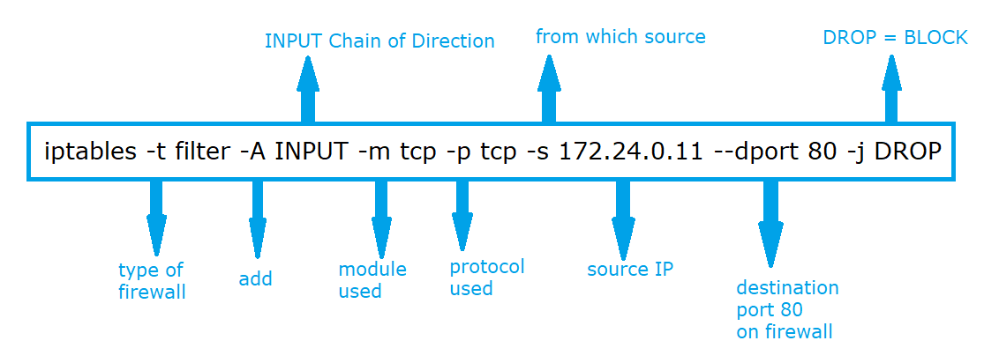
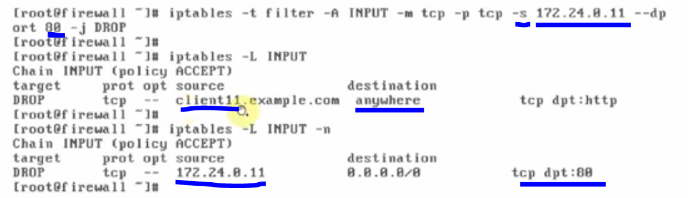
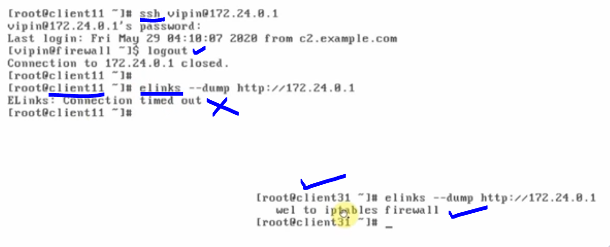
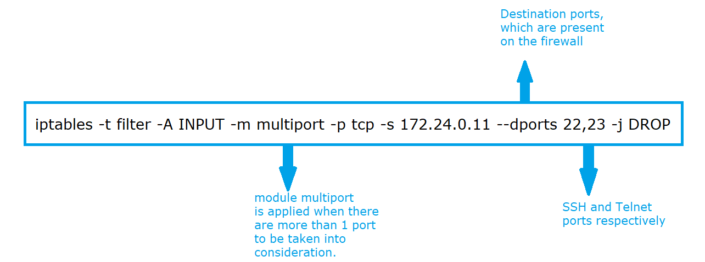
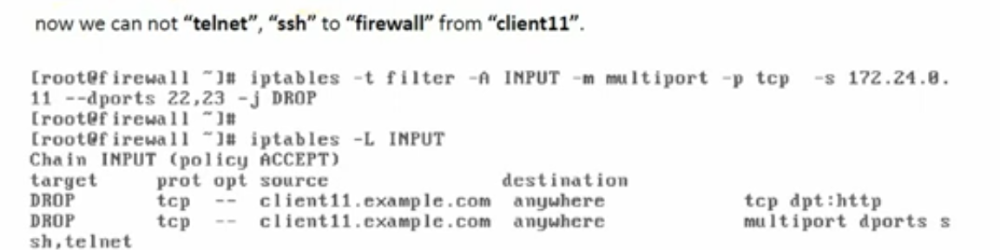
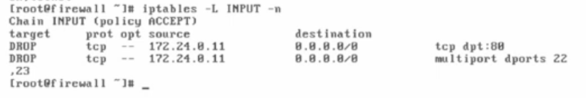
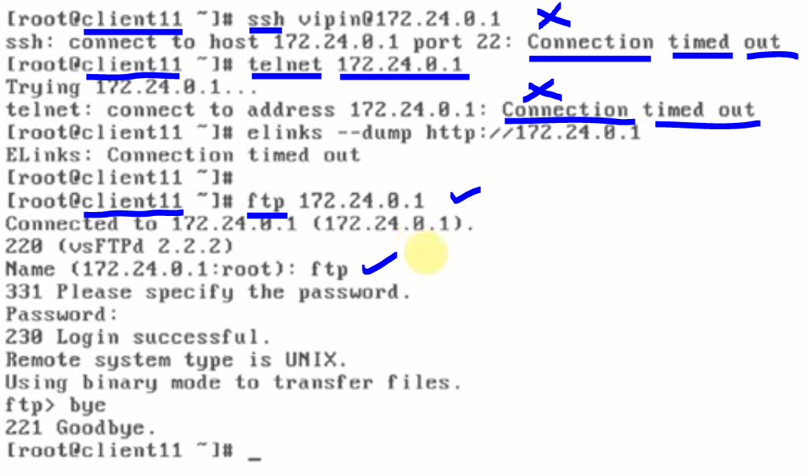

# How to block Ports (INPUT direction, telnet, ssh, web-services)

### We use the similar Lab Setup as we used earlier.

## 

---

### Task - 1 : block web access on firewall from client11, now from client11 we will be not able to access "Web-Server" on firewall

## 

#### blocking is applied through command

## 

### Check from the client11

- We first do ssh from the client11 to firewall, since it is ssh service therfore, it would not produce any issue and ssh will be smoothly done and user will be login successfully.
- However, when we apply for web-server access using port 80 then it will show us an error: Connection time out (CTO)

### Verification:

#### when connected through client11 we tested that ssh is happening however, while we try with web-server access using elinks for the port 80, it shows an error Request time out (RTO), however, when we check the same thing by using client31 then it is successfully tested with port 80 because it is been not blocked from the client31.

## 

---

### Task - 2 : block telnet (23) and ssh (22), we used 2 rules for blocking 2 ports, as we did it in the above case of web-server, however, here we will be using "multiport" module for specifying multiple ports in single rule.

## 

## application:

## 

## Multiport checking:

## 

#### Multiport Verification : If we perform ssh and telnet from the client11 machine to firewall then it will give us an error : Connection timed out (CTO), however if we perform ftp connection then it will not give us any error because ftp works on 20 and 21 port, therefore, SSH and TELNET is blocked by our rule successfully.

## 

---
