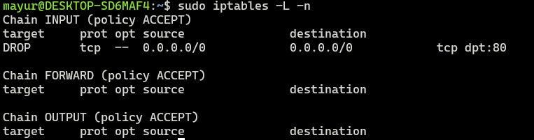
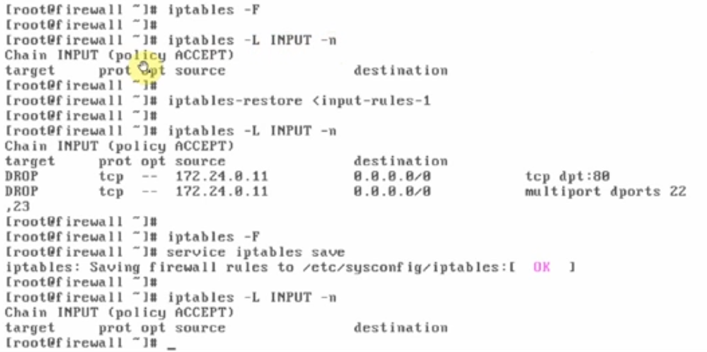

# How to save IP Tables firewall rules

### once you write the rules then they are saved in iptables.

#### apply the following command to see which rules are currently available.

- #### iptables -L -n
- #### for example: 

---

### How to save Rules?

#### iptables-save > input-rules-file

#### (This will save the all your rules into input-rules-file)

#### The real problem occurs when the system reboots, the rules which are applied will be lost after restarting the system.

---

### To make these rules permenantly

#### To save the rules everytime into the system file called iptables on the below path "etc/sysconfig/iptables" , we need to apply the below command. It will automatically update that file into the mentioned location.

#### service iptables save

---

### Restore Rules

- 1. Delete all the rules

> iptables -F

- 2. And then restore rules from "input-rules-file" by using "iptables-restore" command and verify.

### iptables-restore < input-rules-file

## 

#### how to remove the rules from iptables file?

- step 1. apply the command : iptables -F
- step 2. : service iptables save
- step 3. : Reboot the system
- step 4. : verify with: iptables -L -n

---
