# How to Block PING (ICMP)

### Block Ping (ICMP protocol) INPUT Direction

### We will be using the same Lab setup:

## 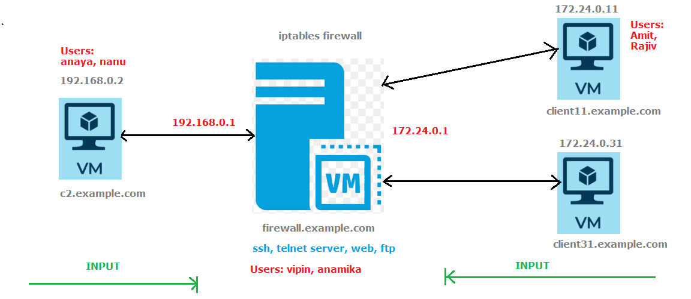

---

### Task-1 : block "Ping" to "Firewall".

#### from "c2" we will not be able to ping the firewall.

#### when we want to control the traffic coming towards the "firewall", we've to use the INPUT chain.

## 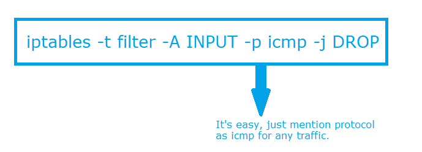

#### After applying the rule, now check from the client machine c2 and ping to firewall machine from c2 machine. It will show 100% packet lost

#### Why it is behaving in this way? as we did not create any rule in OUTPUT chain.

#### The reason is very simple, on pinging, we are sending "echo-request" ICMP packets and in response, we are getting "echo-reply" packets. Since in INPUT chain, we did not mention which type of ICMP packets to block, so it is blocking all types of ICMP packets including "echo-reply"

#### To correct this, we will delete the previous rule by using -D, replace -A and write a new rule blocking only "echo-request" packets.

## 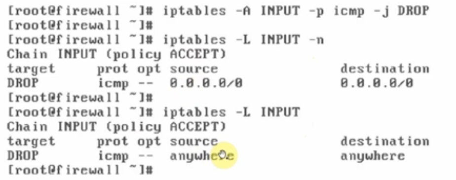

## 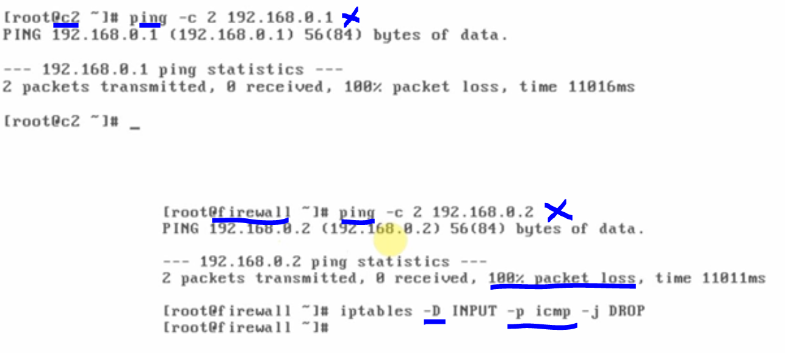

### Note: the ping from any machine to firewall is blocked also the previous rule strictly remove "echo-request" icmp protocol too. Hence, ping from firewall to any machine is also not possible. Here OUTPUT chain is also affected in the case of firewall.

### to solve this, we've already deleted the previous rule and now we will add the new rule which would be as follows:

## 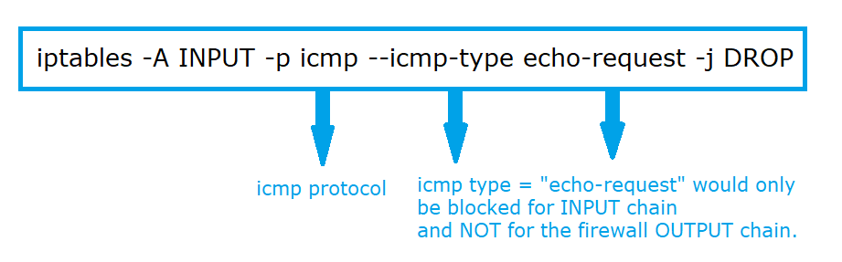

## 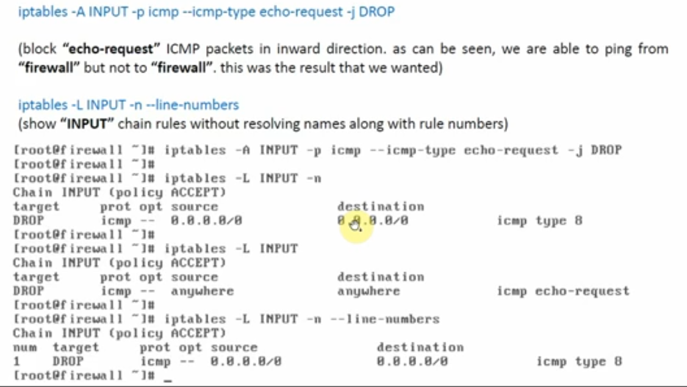

#### now check the PING from c2 machine towards the firewall. It will show 100% packet lost (CTO), however, if you ping from firewall to C2 machine, then it will show you sucessful ping from firewall to any connected network machine.

## 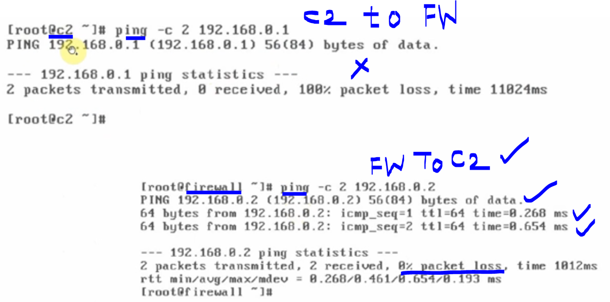

hence, it proves

- #### 1. echo-request to firewall would be blocked and ping would not be successful by ICMP

- #### 2. echo-reply from firewall to any machine would be successful due to the rule and PING would be successful to any machine.

---

---

# Reverse the process by blocking the echo-reply in ICMP

### this is exact reverse process of previous rule, therefore, we will apply the below command to replace the echo-request with echo-reply.

#### Replace the rule

## 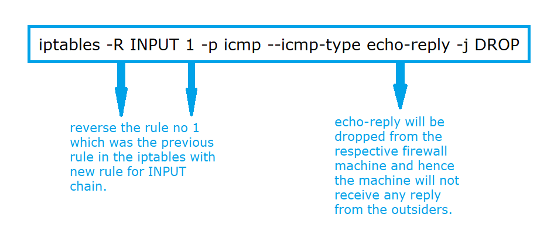

---

### also we will use the below command to show INPUT chain rules along with packet/byte counters.

## 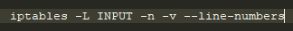

#### see the packet/byte counter to zero

## 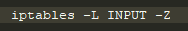

### Now we will check by pinging from the machine firewall to client-2

## 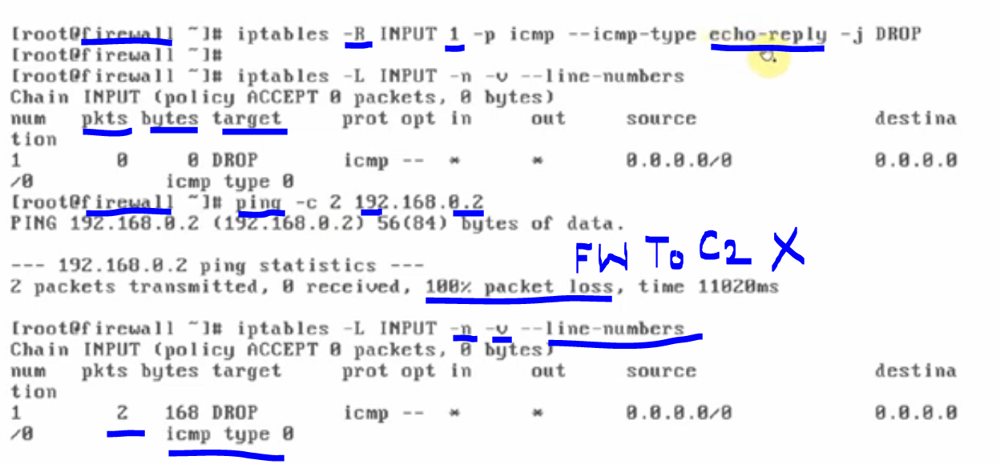

#### Now the ping from c2 to firewall will be applicable and PING would be successful because, the rule is set to "echo-reply" and hence, firewall receive the packet from the c2 machine due to "echo-request".

## 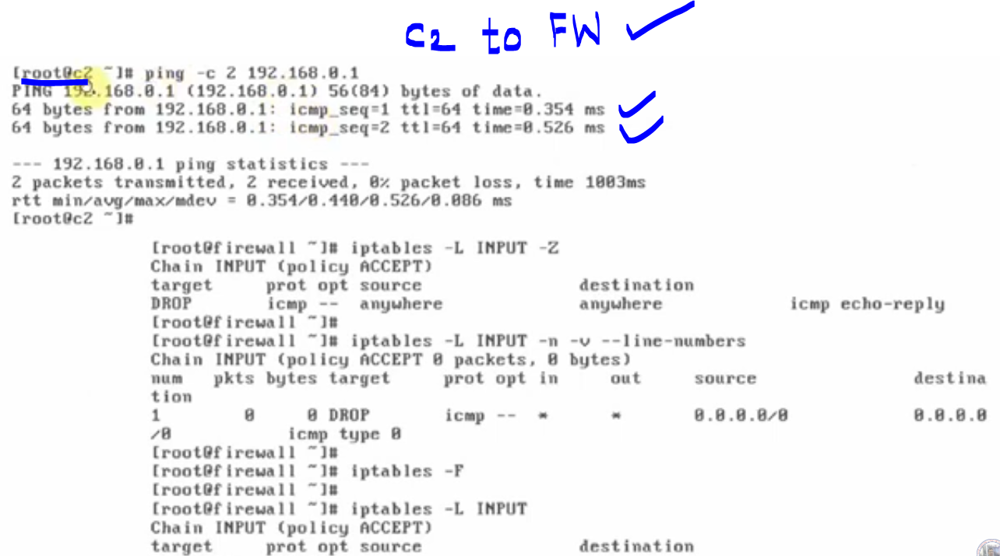
