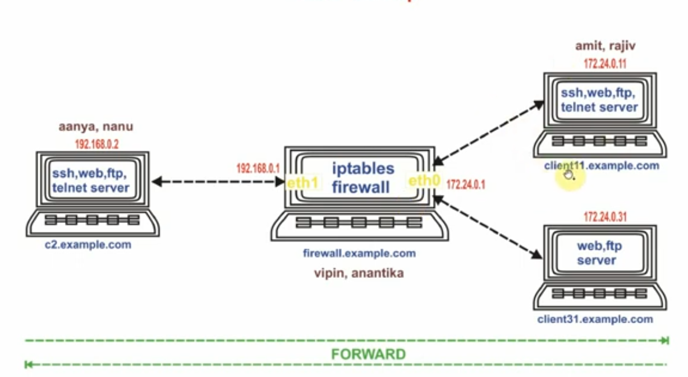
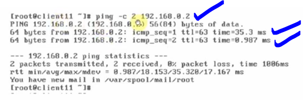
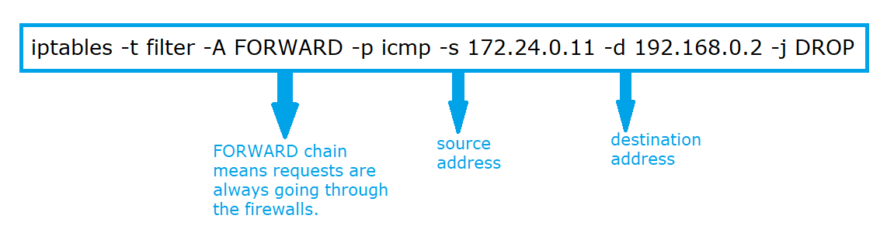
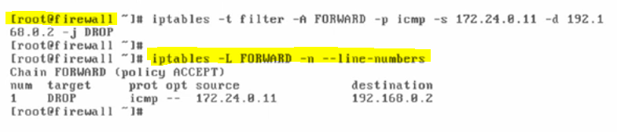
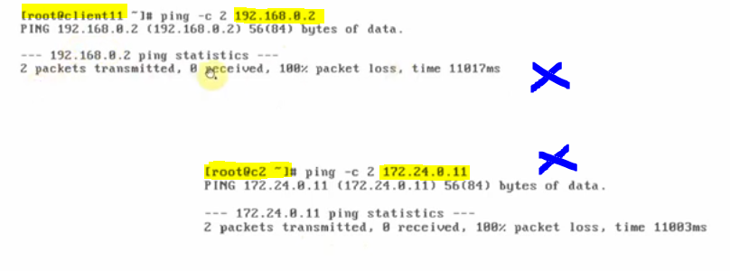
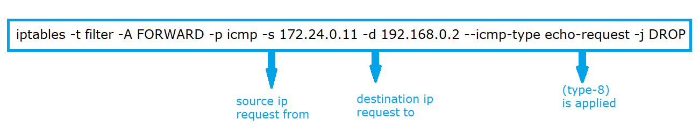
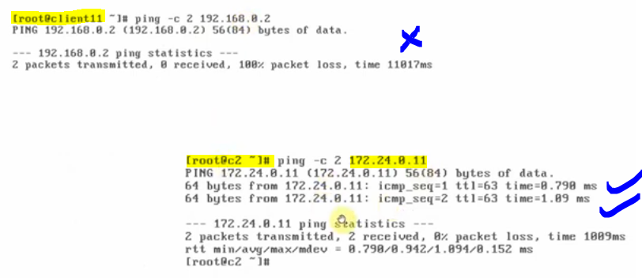
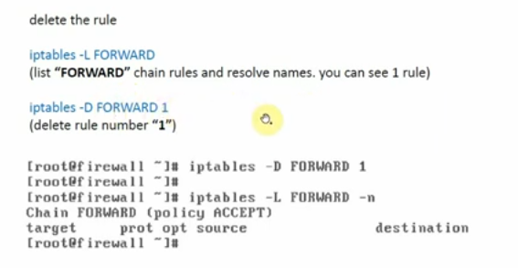

# Block PING (forward direction, icmp protocol)

## The forward direction as discussed earlier meaning that the request goes through firewall from machine to another machine.

### We will be using the following architecture for the entire scenarios.

---

### Task-1: we're blocking the ping from client "11" to client "c2"

#### when we control the traffic from crossing through the "firewall", we have to choose "FORWARD" chain.

### General check before performing the task-1

---

### Applying the rule:

---

#### however, the rule is applied on the firewall and not on any machine.

---

#### In above diagram, we are blocking ICMP packets from "172.24.0.11" and going towards "192.168.0.2", since we are filtering packets that are passing through "firewall", we have added rule in "FORWARD" chain and filter table. "ping" comes under the ICMP.

### Now, if we ping again then ping is not working from client "11" to client "c2"

#### by observing the above diagram we have seen that the rule is applied and request from client "11" to client "c2" has been successfully blocked. However, the request from client "c2" to client "11" is also blocked and here is the problem. The request goes from client c2 to client c11 must not be blocked. Therefore, in this observation we've found that it is blocking both types called "echo-requests" (type-8) and "echo-reply" (type-0), therefore, we will correct this by applying the following correct FORWARD RULE to achieve our scenario.

#### Step-1 : we will delete the above rule first. By applying

- iptables -F

#### Step-2 : we will apply the following rule.

#### Verification from both sides.

#### The verification is successful our scenario as the request from client "c11" to client "c2" was blocked successfully. However, earlier request from "c2" to "c11" was blocked but now it is successfully pinging the client "11"

---

### How to delete the FORWARD rule.

