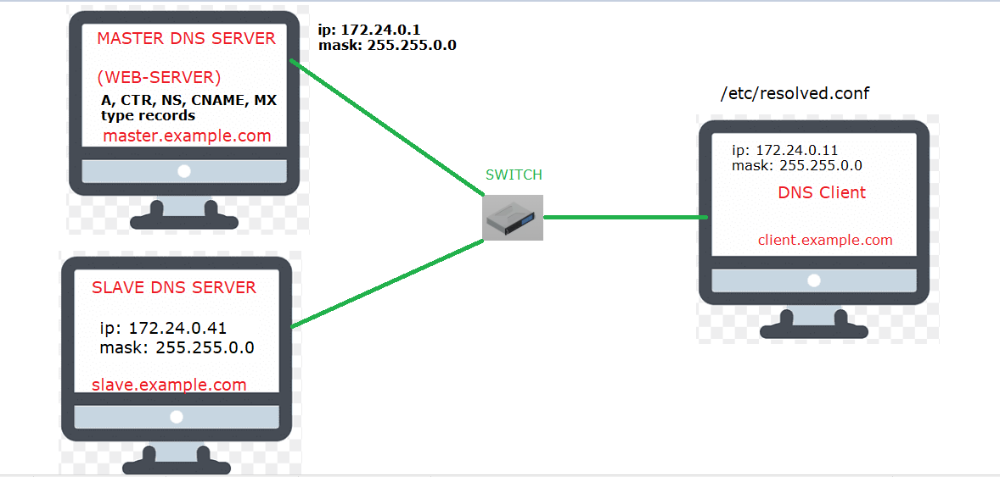
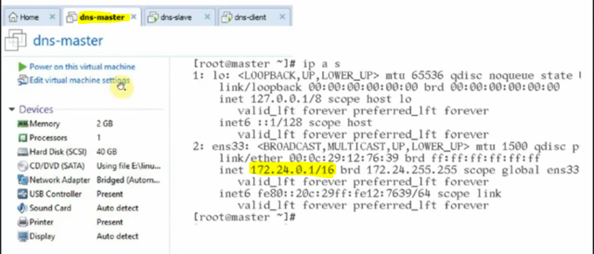
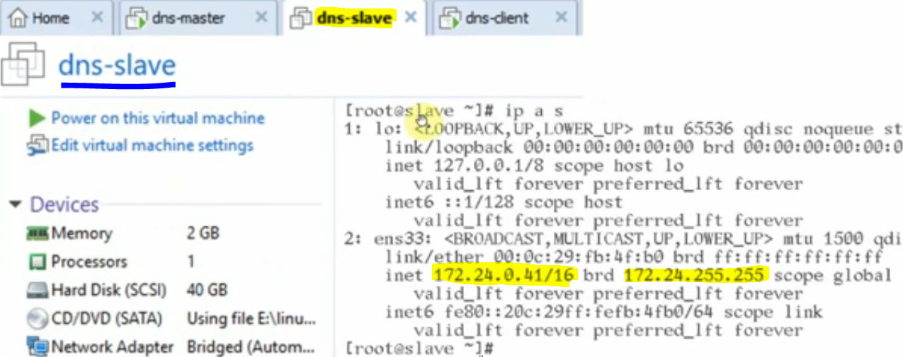
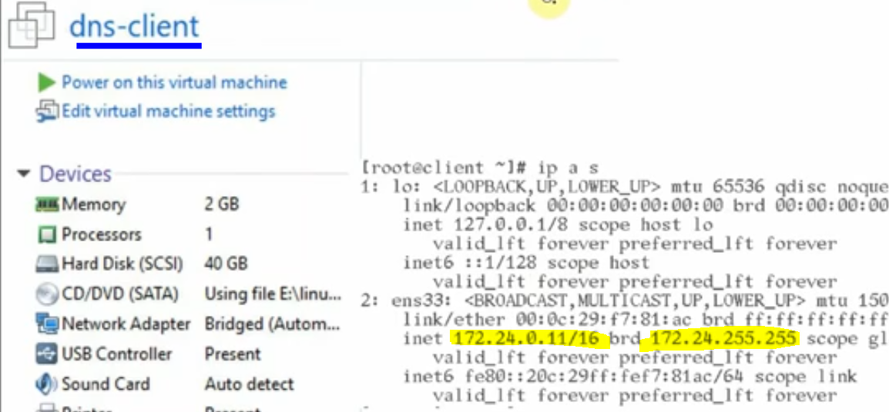

# DNS Lab Setup

#### First we will go with a example where you will better understand DNS the very practical way and you will not hesitate to understand the theory afterwards.

#### We will have the following architecture where we can perform operations using the lab setup. For the lab setup we are following the below MASTER-SLAVE architectue.

#### We will setup the lab as shown in the above diagram, we will take 3 systems:

- "172.24.0.1" will act as a Master DNS Server.
- "172.24.0.41" will act as a Slave DNS Server.
- "172.24.0.11" will act as a Client DNS Server.

#### We will implement "web-server" and "ftp-server" on "172.24.0.1" (MASTER DNS).

#### We will also assume the presence of mail servers on "172.24.0.1" (MASTER DNS) and "172.24.0.41" (SLAVE DNS)

#### Task to achieve OR Purpose is:

- http://www.example.com will be accessed from client machine instead of http://172.24.0.1
- http://download.example.com will be accessed from client machine instead of ftp://172.24.0.1

#### It means it will resolve the DNS name instead of the server IP

---

#### 1. DNS-Master will be configured at the time of machine creation and it must belongs to 172.24.0.1 with mask 255.255.0.0

---

#### 2. DNS-Slave will be configured at the time of machine creation and it must belongs to 172.24.0.41 with mask 255.255.0.0

#### 3. DNS-Client will be configured at the time of machine creation and it must belongs to 172.24.0.11 with mask 255.255.0.0

