# DNS Master Server Setup (Configuration Settings)

#### Step-1 : Set Hostname, Disable firewalld and NetworkManager.

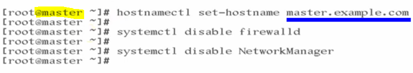

#### Step-2 : Change SELinux Policy From Enforcing to Disabled

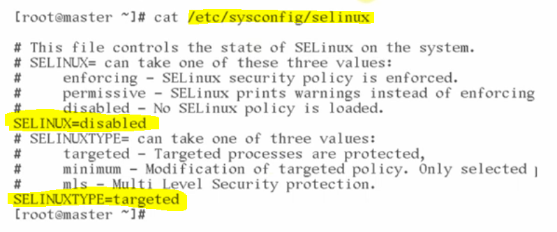

---

#### Note: When you configure the VM machine on VMWare then it must be configured with NAT settings to access the Internet on the VM machine.

---

#### Step-3: Location and Initial Settings of "ifcfg-ens33" file.

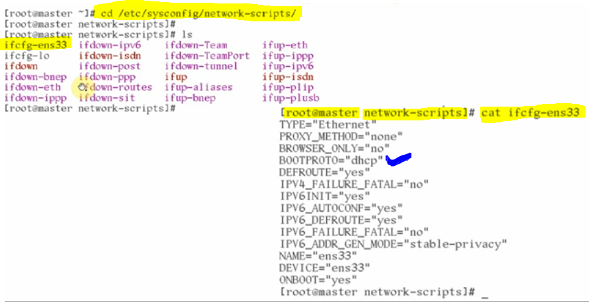

- then, initial settings of "/etc/hosts/" file
  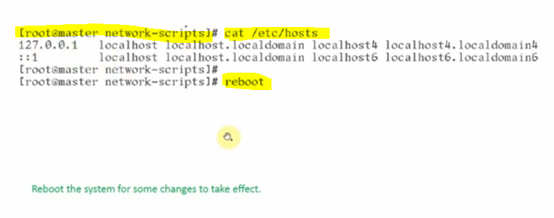

#### Step-4: Firewall settings from which we will Flush all the rules.

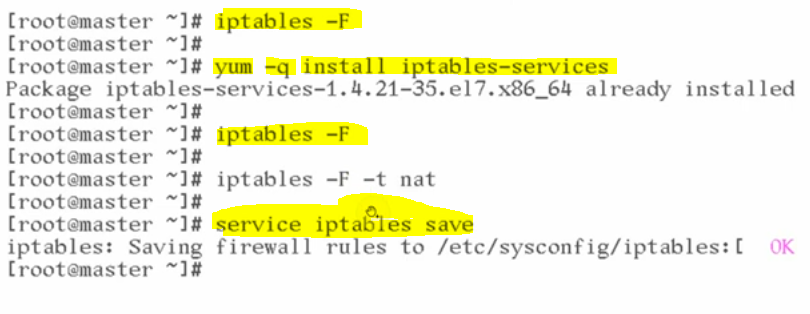

- to flush the rules we need to install, iptables-service.

#### Step-5: Install the required packages like elinks, wget, git and curl packages.

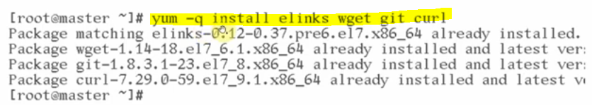

#### Step-6: Install bind, and bind-utils packages.

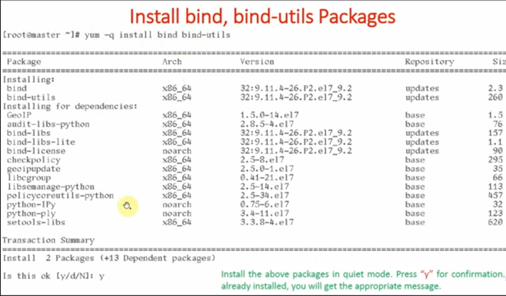
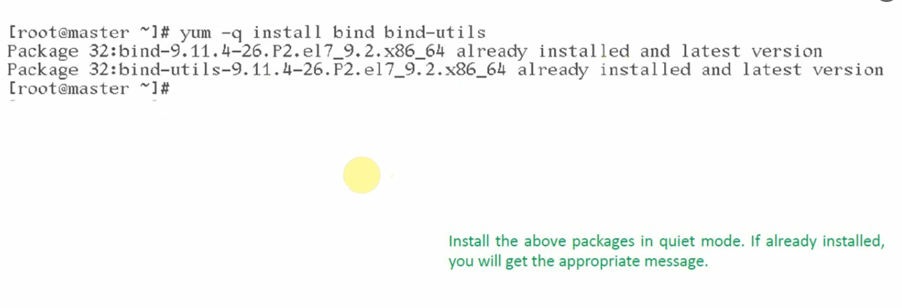

---

#### Step-7 : Install web server package

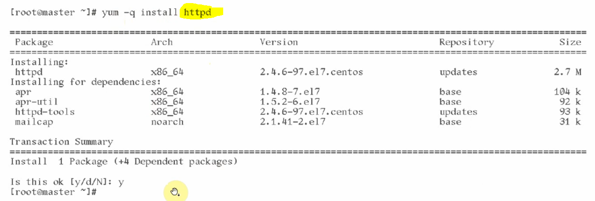

#### Step-8 : Install FTP server

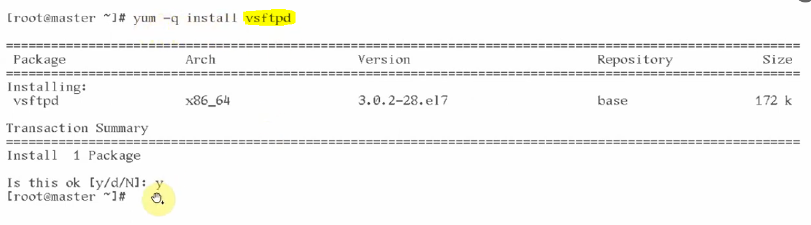

#### Step-9 : Assign Static IP and Verification.

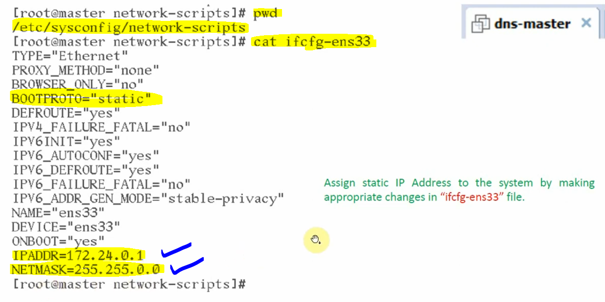

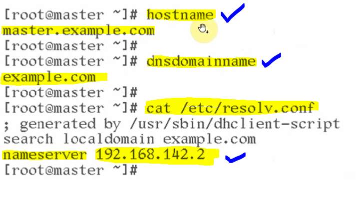

#### Add entry into /etc/hosts file too.

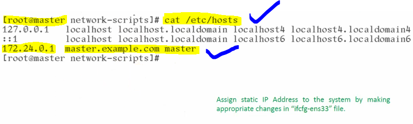

#### Change the setting from NAT to Bridge for all the 3 VM-machines to communicate with each other.

---

#### All Verifications By CLI (Command Line Interface) on DNS_Master

#### 1. Hostname

## 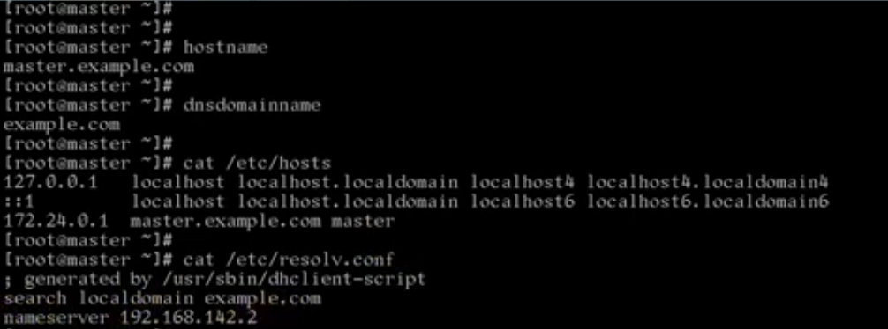

#### 2. SEStatus

## 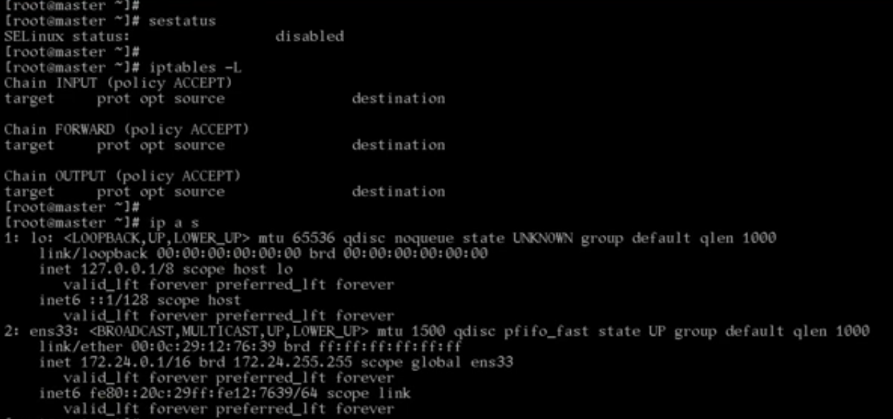

#### 3. IfcfgEns file

## 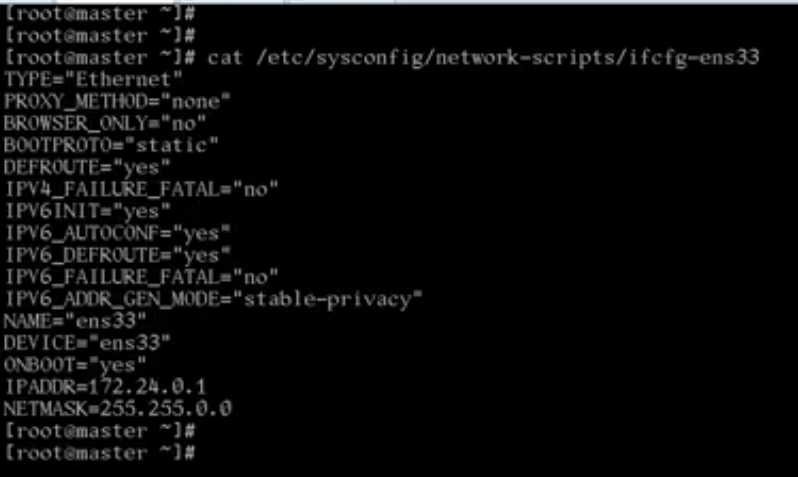

#### 4. NAT bridging setting

## 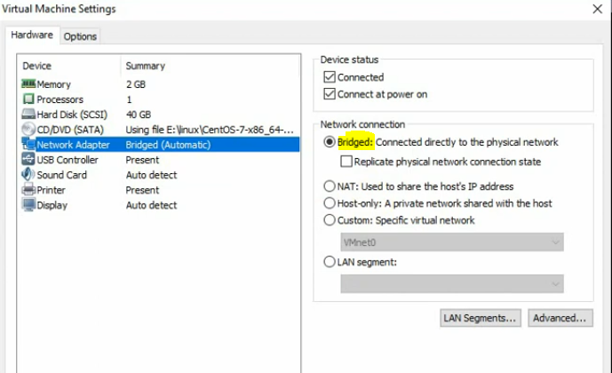

#### 5. All package installation check.

## 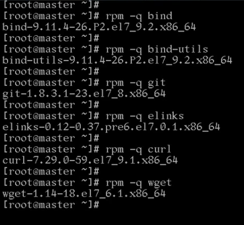

#### 6. SELinux file configuration check

## 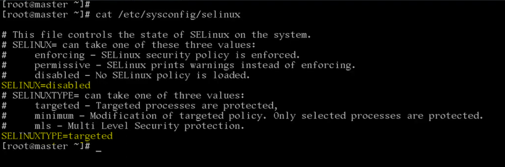

#### 7. httpd and ftp download package check

## 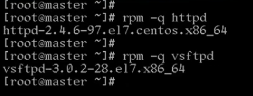
