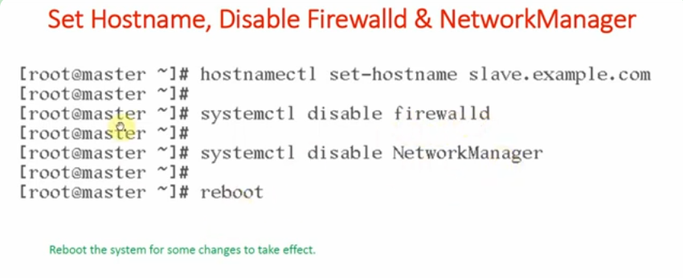
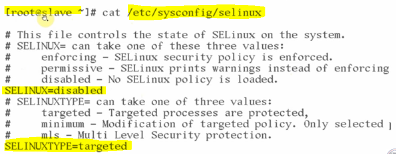
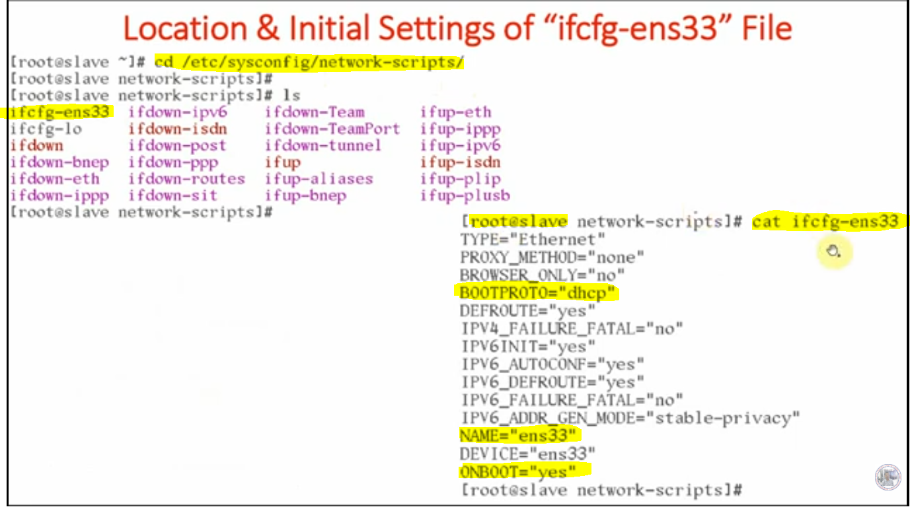
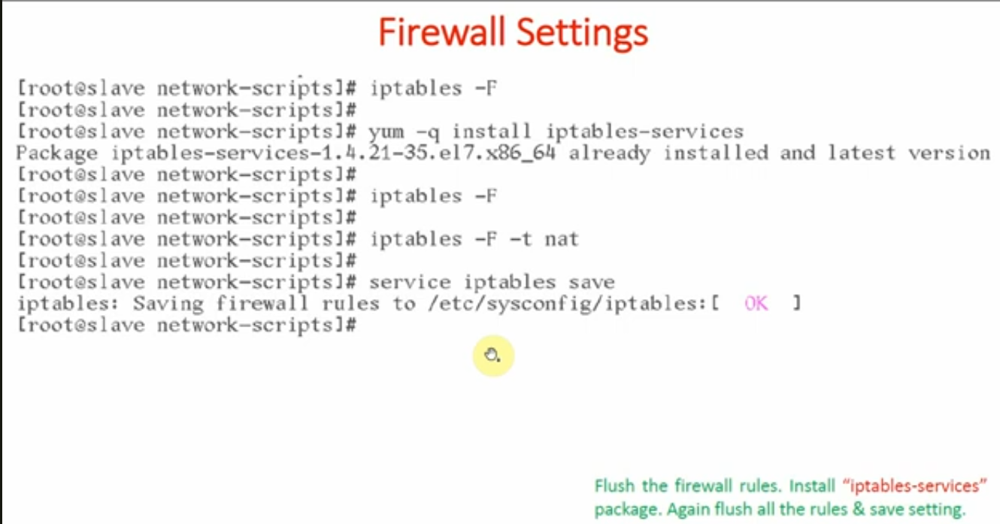
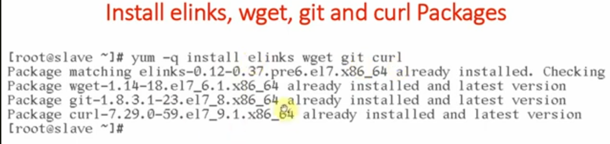
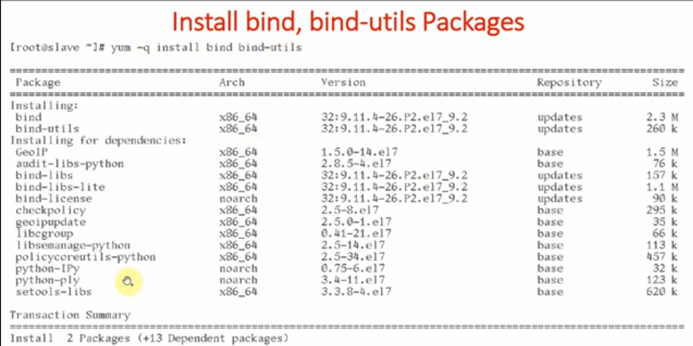
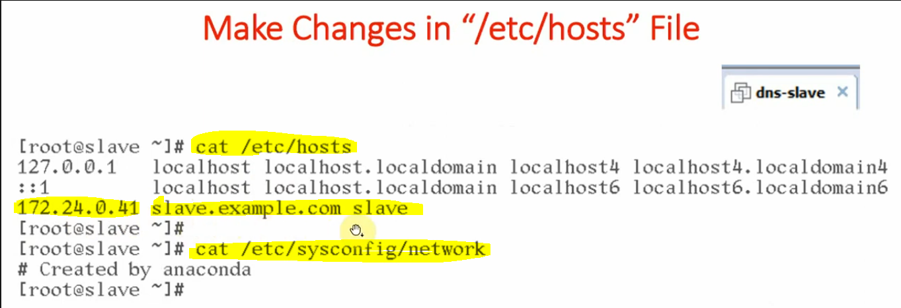
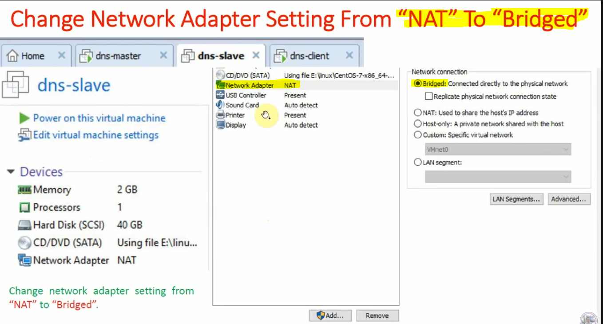
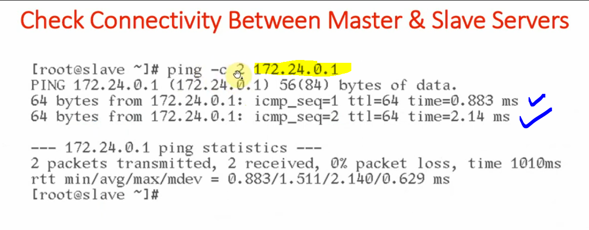

# DNS Slave Server Setup

#### Step-1: The Slave setup, set hostname, disable firewall and NetworkManager

- By default machine was set as @master but later on we have changed it to the slave.

#### Step-2: The SELinux Policy changed from enforcing to disabled.

- By default the network settings is NAT

#### Step-3: Location and Initial settings of ifconfig-ens33 file.

#### Step-4: Disable all firewall settings.

#### Step-5: Install All the necessary packages.

#### Step-6: Install Bind and Bind-Utils

#### Step-7: Assign Static IP Address

#### Step-8: Very Important change, make changes in /etc/hosts file.

#### Step-9: Change Network setting from NAT to Bridge for the communication.

- Reboot the system to see the changes.

#### Step-10: Verification from Slave to Master Connectivity.

