# DNS client machine setup.

#### Step-1 : Set hostname, disable firewalld and NetworkManager

#### Step-2: Disable SELinux

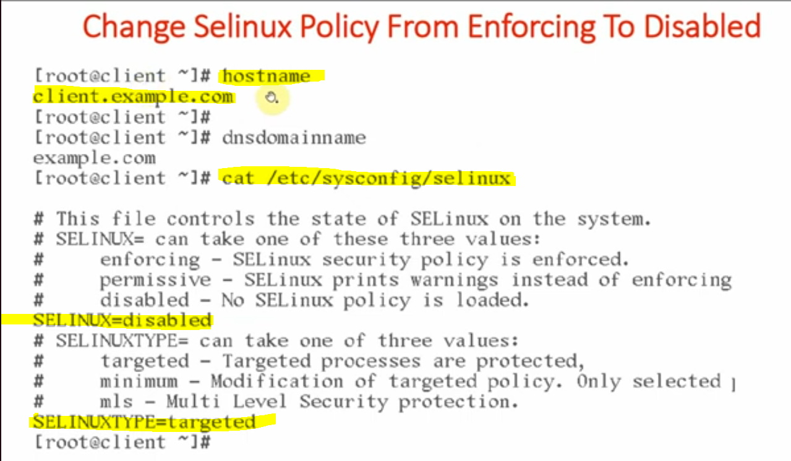

#### Step-3: Change the location and initial settings of "ifcfg-ens33" file

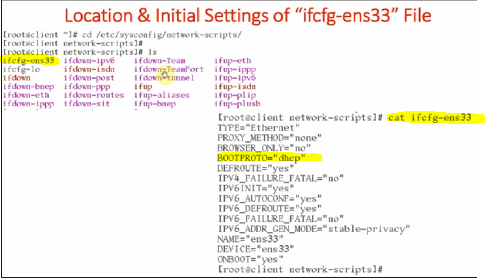

#### Step-4: Disable firewall policies

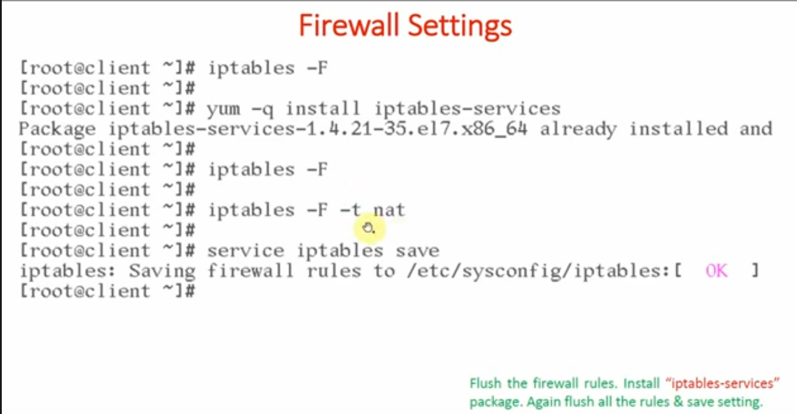

#### Step-5: Install Client DNS necessary packages

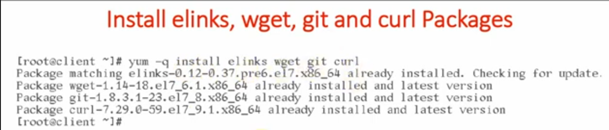

#### Step-6: Install only Bind-Utils package and do not install Bind package. Bind package installed only on Master and Slave.

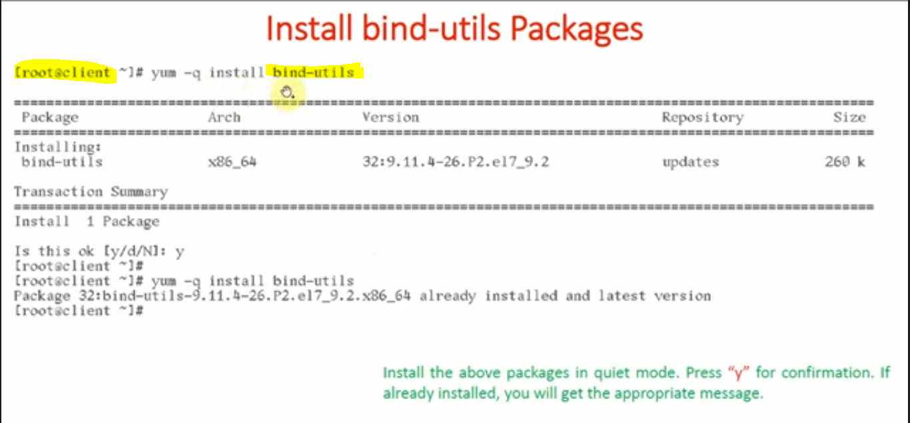

#### Step-7: Assign Static IP Address

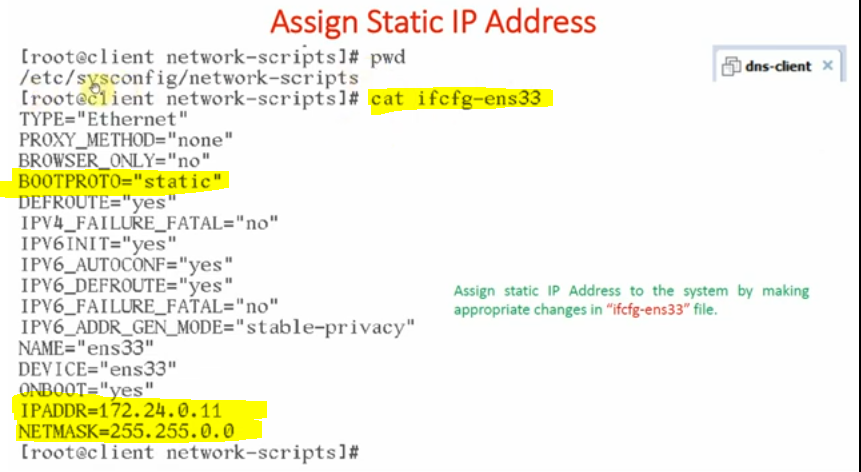

#### Step-8: Very Important Entry to add the address into /etc/hosts file.

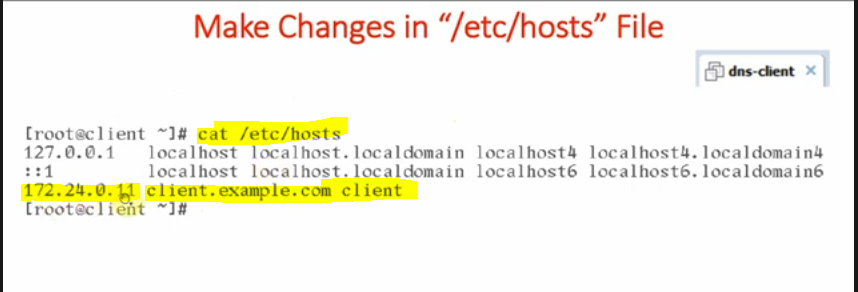

#### Step-9: Change the network settings from NAT to Bridged

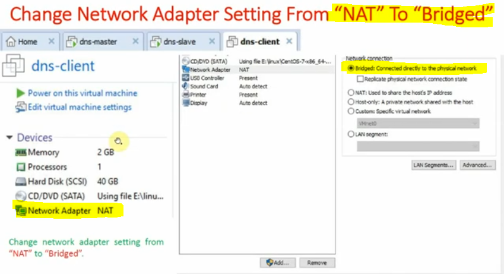

- Reboot the system to see the changes.

#### Step-10: Verify the static IP is assigned or not?

- The static IP will be set to the machine.
  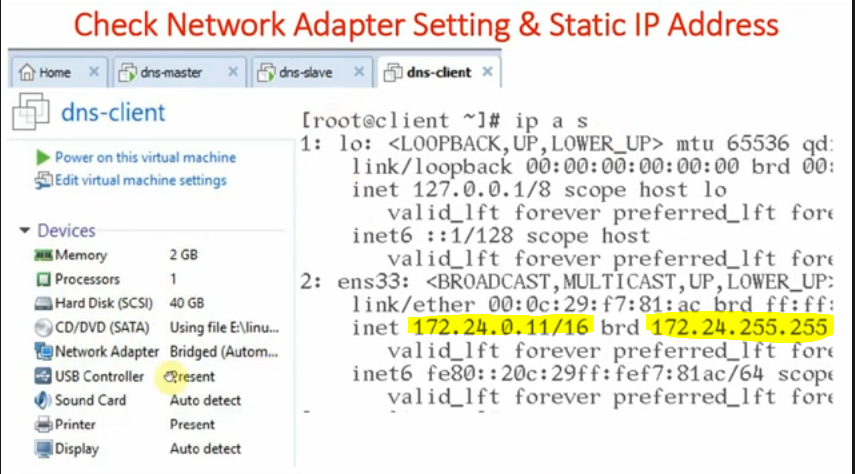

#### Step-11: Check the connectivity between Client machine to Master

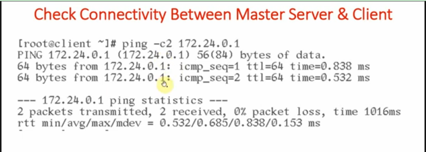

---

#### DNS-Client Machine Verification through CLI

#### 1. Hostname

## 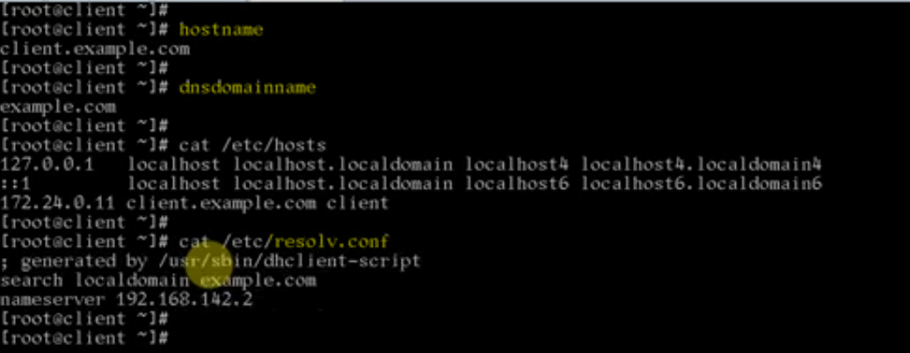

---

#### 2. ifcfg ens33 file

## 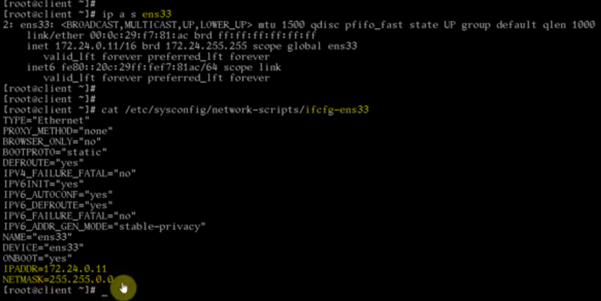

---

#### 3. SELinux Status

## 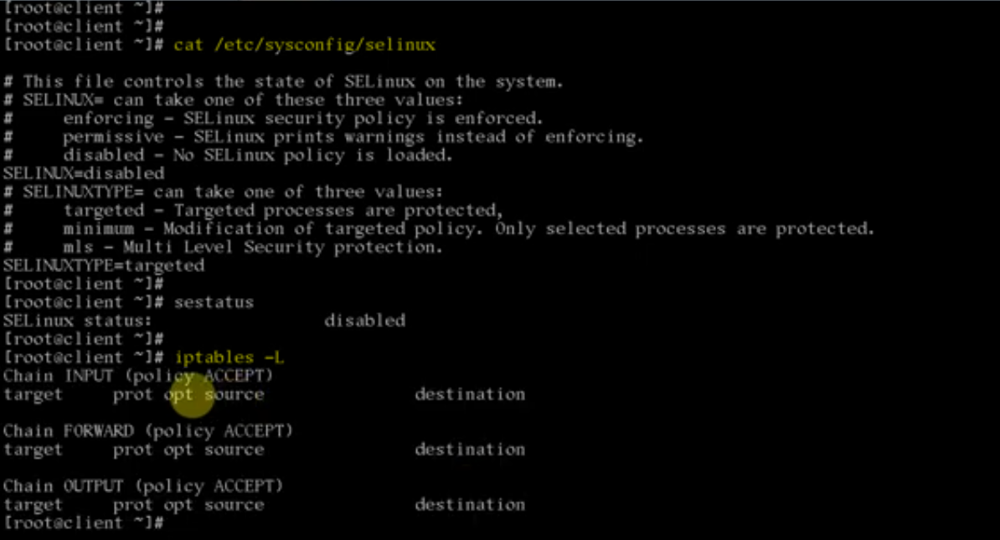

---

#### 4. All Packages Installation check

## 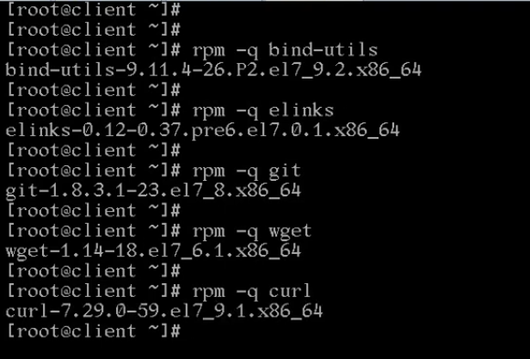

---

#### 5. PING to Master DNS check

## 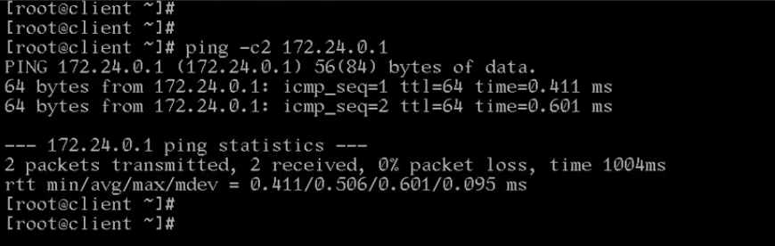
